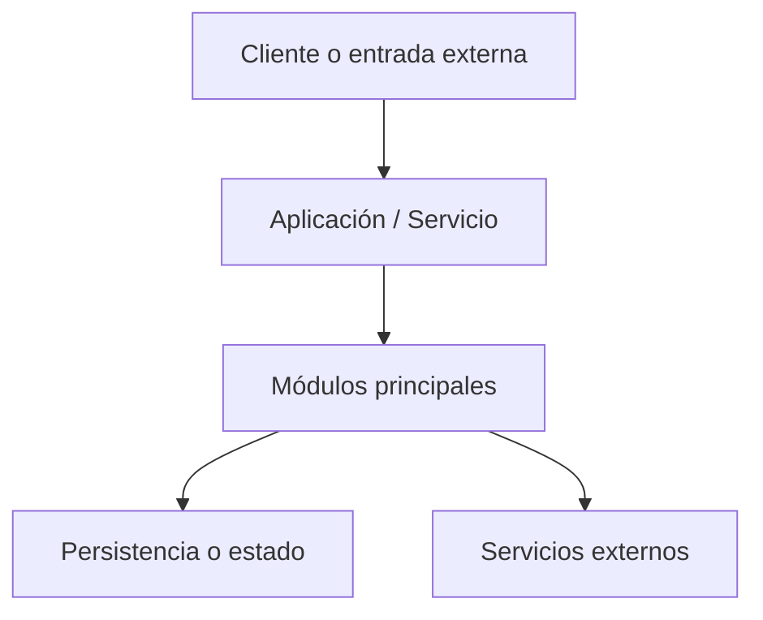
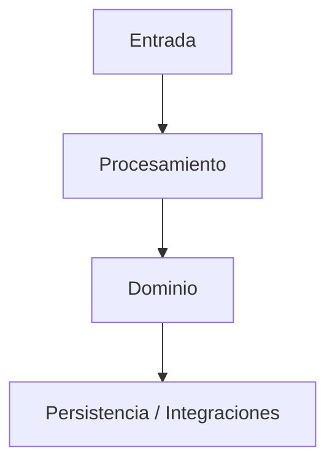
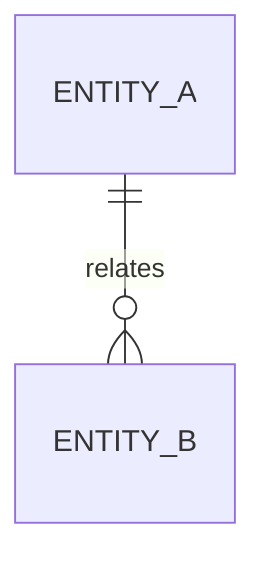
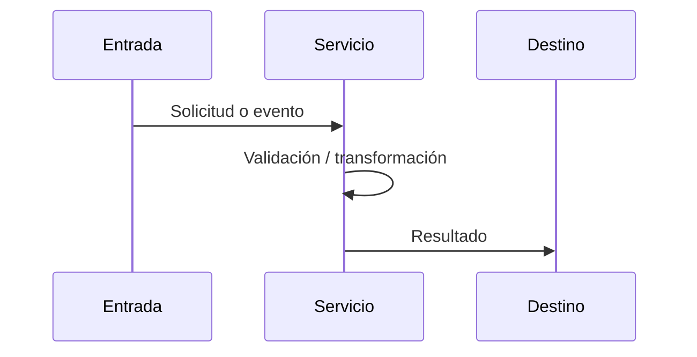

# Generic Tech Doc Builder

Prompt genérico para generar una memoria técnica entregable de cualquier proyecto, con estructura `docs/`, diagramas Mermaid y exportación DOCX mediante Pandoc.

Uso esperado: sustituir únicamente `NOMBRE_PROYECTO` y `RUTA_PROYECTO`.

```text
NECESITO GENERAR UNA MEMORIA TÉCNICA COMPLETA, PROFESIONAL Y ENTREGABLE DEL PROYECTO.

Nombre del proyecto:
NOMBRE_PROYECTO

Ruta del proyecto:
RUTA_PROYECTO

OBJETIVO GENERAL:
Analizar el proyecto, redactar una memoria técnica descriptiva orientada a cliente/equipo técnico, crear una estructura docs/ reproducible, generar diagramas Mermaid, montar un pipeline Markdown + Mermaid CLI + Pandoc, y exportar un DOCX final con diagramas renderizados.

TONO DEL DOCUMENTO:
- Debe ser una memoria técnica de entregable, no una auditoría.
- No redactar como informe de riesgos, revisión interna o lista de defectos.
- No insistir en mejoras, problemas, deuda técnica o recomendaciones salvo que sean necesarias como “consideraciones de entrega” en tono neutro.
- Priorizar descripción clara de qué es el sistema, cómo está construido, cómo se configura, cómo se ejecuta y cómo se relacionan sus partes.
- Usar español profesional con tildes y ortografía cuidada.

REGLAS ESTRICTAS:
- NO modificar código fuente.
- NO refactorizar.
- NO crear migraciones.
- NO ejecutar cambios sobre base de datos.
- NO cambiar configuración funcional del proyecto.
- NO instalar dependencias automáticamente.
- SOLO leer, analizar y documentar.
- La escritura permitida se limita a:
  - crear/actualizar docs/
  - crear scripts de build documental dentro de docs/build/
  - actualizar .gitignore para excluir artefactos generados, si existe.
- Si una herramienta no está disponible, detectarlo y documentarlo; no instalarla sin permiso explícito.

ALCANCE DEL ANÁLISIS:
Inspeccionar el proyecto de forma estática, identificando:
- Estructura general.
- Lenguaje y framework principal.
- Punto de entrada.
- Configuración y variables de entorno.
- Dependencias.
- Módulos principales.
- Modelos, entidades, esquemas, DTOs o contratos.
- Rutas, endpoints, comandos, jobs, servicios, workers o interfaces disponibles.
- Persistencia, base de datos, migraciones o almacenamiento.
- Autenticación y autorización, si aplica.
- Integraciones externas.
- Logging y observabilidad.
- Scripts auxiliares.
- Tests existentes.
- Dockerfile, docker-compose o mecanismos de ejecución, si existen.
- Relaciones entre módulos.
- Flujos funcionales principales.

EXCLUSIONES:
- Ignorar carpetas de entorno local como venv, .venv, env, node_modules, __pycache__, dist, build, target, coverage, .git.
- Ignorar artefactos binarios, logs, caches y exports generados.
- No incluir rutas absolutas locales en la memoria final salvo que sean estrictamente necesarias. Usar rutas relativas al proyecto.

RESULTADO ESPERADO:
Crear esta estructura dentro de RUTA_PROYECTO:

docs/
  MEMORIA_TECNICA_BACKEND.md
  assets/
    diagramas/
    img/
  build/
    build-docx.ps1
    reporte-build.md
    build-unificado.md        # generado, no editar
  exports/
    MEMORIA_TECNICA_<NOMBRE_PROYECTO>.docx
  generated/
    diagrams/
  reference.docx              # opcional

NOMBRE DEL DOCX:
Usar un nombre limpio basado en el proyecto:

docs/exports/MEMORIA_TECNICA_<NOMBRE_PROYECTO_NORMALIZADO>.docx

Donde <NOMBRE_PROYECTO_NORMALIZADO> debe ir en mayúsculas, sin espacios problemáticos, usando guiones bajos.

MEMORIA TÉCNICA:
Crear o actualizar:

docs/MEMORIA_TECNICA_BACKEND.md

El Markdown debe incluir front matter:

---
title: "Memoria Técnica NOMBRE_PROYECTO"
author: "Desarrollo"
date: "2026"
toc: true
numbersections: true
---

IMPORTANTE SOBRE NUMERACIÓN:
- NO numerar manualmente los headings.
- Correcto:
  # Memoria técnica del proyecto
  ## Introducción
  ## Arquitectura general
  ### Diagrama de capas
- Incorrecto:
  ## 1. Introducción
  ### 1.1 Diagrama de capas
- Pandoc añadirá la numeración con --number-sections.

ESTRUCTURA RECOMENDADA DE LA MEMORIA:

# Memoria técnica de NOMBRE_PROYECTO

## Introducción
Describir el propósito del proyecto como producto o componente entregable.

## Objetivo del documento
Explicar que la memoria describe arquitectura, configuración, módulos, contratos, ejecución e integraciones.

## Alcance del proyecto
Listar funcionalidades cubiertas y límites del componente en tono descriptivo.

## Arquitectura general
Tabla de capas:
- Entrada.
- Routing/controladores/interfaz.
- Servicios.
- Dominio/modelos.
- Persistencia.
- Integraciones.
- Tests.
- Despliegue.

Añadir Mermaid de arquitectura:



Añadir diagrama de capas:



## Estructura de directorios
Mostrar árbol relevante con rutas relativas, sin ruido local.

## Tecnologías utilizadas
Tabla con tecnología, versión si puede confirmarse y uso.

## Configuración del entorno
Tabla de variables de entorno o ficheros de configuración:
- Variable/archivo.
- Valor por defecto si existe.
- Uso.

## Punto de entrada y ciclo de arranque
Describir cómo arranca el proyecto, comandos principales y flujo de inicialización.

## Persistencia y datos
Describir base de datos, migraciones, almacenamiento o ausencia de persistencia propia.

## Modelos, entidades o contratos principales
Documentar modelos ORM, entidades de dominio, DTOs, schemas, payloads, topics, comandos o interfaces.
Incluir Mermaid ER si aplica:



## Interfaces disponibles
Según el tipo de proyecto, documentar:
- Endpoints HTTP.
- Comandos CLI.
- Topics MQTT.
- Jobs.
- Workers.
- Eventos.
- Funciones públicas.
- Scripts.

Para cada interfaz incluir:
- Tipo/método.
- Nombre/ruta/topic/comando.
- Fichero.
- Propósito.
- Entrada.
- Salida.
- Dependencias internas relevantes.

## Flujos funcionales
Añadir diagramas Mermaid sencillos para los flujos principales:
- Arranque.
- Autenticación, si aplica.
- Procesamiento principal.
- Persistencia o publicación.
- Integración externa.

Ejemplo:



## Seguridad
Describir autenticación, autorización, aislamiento, credenciales, validaciones y controles existentes, en tono descriptivo.

## Logging y observabilidad
Describir logs, métricas, trazas, healthchecks o mecanismos disponibles.

## Despliegue y ejecución
Documentar ejecución local, Docker, docker-compose, scripts y comandos principales.

## Dependencias externas
Tabla de servicios externos y uso.

## Tests
Describir pruebas existentes y qué validan.

## Consideraciones de entrega
Sección neutra, no auditoría. Incluir:
- Configuración requerida.
- Artefactos incluidos.
- Supuestos de ejecución.
- Dependencias necesarias.
- Relación con otros sistemas.

## Resumen ejecutivo final
Resumen claro del componente, su papel y su arquitectura.

CRITERIOS DE CALIDAD:
- No inventar funcionalidades.
- Citar nombres reales de carpetas, archivos, clases y funciones.
- Diferenciar confirmado por código e inferencia técnica.
- Usar tablas cuando aporten claridad.
- Diagramas Mermaid simples y legibles.
- No meter rutas absolutas personales.
- No incluir secretos ni valores sensibles reales.
- No escribir una auditoría de problemas.
- No duplicar numeración manual en headings.
- Ortografía española correcta, con tildes.

PIPELINE DOCX:
Crear:

docs/build/build-docx.ps1

El script debe:
1. Ejecutarse desde `cd docs`.
2. Leer `MEMORIA_TECNICA_BACKEND.md`.
3. Detectar bloques:

```mermaid
...
```

4. Extraerlos a `build/diagram-001.mmd`, `build/diagram-002.mmd`, etc.
5. Renderizar SVG con Mermaid CLI (`mmdc`).
6. Si no existe `rsvg-convert`, generar PNG fallback con Mermaid CLI y usar PNG en el Markdown temporal.
7. Crear `build/build-unificado.md`, sustituyendo Mermaid por imágenes.
8. Ejecutar Pandoc:

```powershell
pandoc build/build-unificado.md -o exports/MEMORIA_TECNICA_<NOMBRE_PROYECTO_NORMALIZADO>.docx --toc --toc-depth=2 --number-sections --resource-path=.;build;generated/diagrams;assets;assets/img;assets/diagramas
```

9. Si existe `reference.docx`, añadir:

```powershell
--reference-doc=reference.docx
```

10. Crear `build/reporte-build.md` con:
- Fecha.
- Rutas usadas.
- Estado de Pandoc.
- Estado de Mermaid CLI.
- Estado de rsvg-convert.
- Mermaid detectados.
- SVG generados.
- PNG generados.
- Errores de render.
- Estado final del DOCX.

SI FALTAN HERRAMIENTAS:
- Si falta Pandoc, detener build e indicar instalación requerida.
- Si falta Mermaid CLI, detener build e indicar:

```powershell
npm install -g @mermaid-js/mermaid-cli
```

- No instalar automáticamente.

.gitignore:
Si existe .gitignore, añadir sin romper contenido:

docs/build/build-unificado.md
docs/build/diagram-*.mmd
docs/exports/*.docx
docs/exports/*.pdf
docs/generated/diagrams/*.svg
docs/generated/diagrams/*.png

COMANDO FINAL ESPERADO:

```powershell
cd docs
.\build\build-docx.ps1 -Clean
```

AL FINAL INFORMAR:
- Archivos creados.
- Ruta Markdown.
- Ruta DOCX.
- Ruta reporte.
- Mermaid detectados.
- SVG/PNG generados.
- Errores de render.
- Estado Pandoc.
- Dependencias faltantes si aplica.
- Confirmar que no se modificó código fuente.
```

