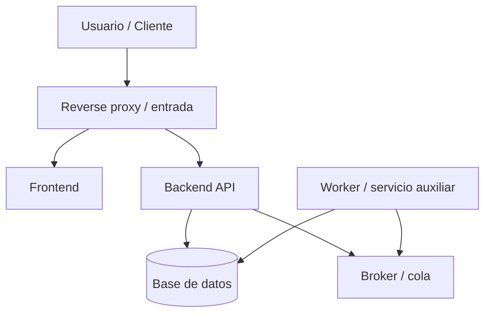
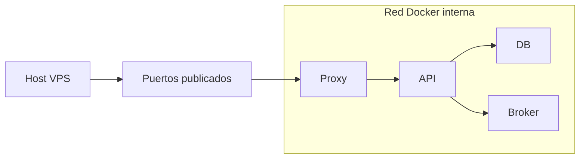
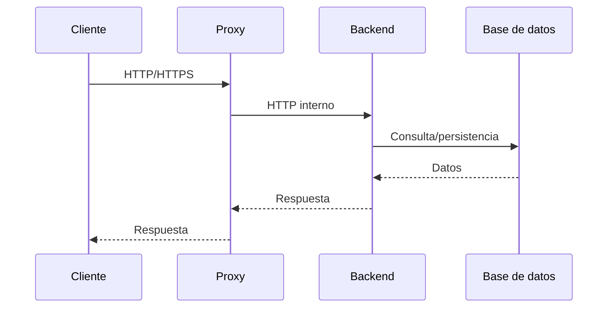

# Multi Docker Tech Doc Builder

Prompt genérico para documentar una réplica de despliegue en VPS compuesta por varios proyectos interrelacionados, Dockerfiles, contenedores y `docker-compose`.

Uso esperado: sustituir únicamente `NOMBRE_DESPLIEGUE` y `RUTA_DESPLIEGUE`.

```text
NECESITO GENERAR UNA MEMORIA TÉCNICA COMPLETA, PROFESIONAL Y ENTREGABLE DE UN DESPLIEGUE MULTI-PROYECTO CON DOCKER.

Nombre del despliegue o solución:
NOMBRE_DESPLIEGUE

Ruta raíz de la réplica del despliegue:
RUTA_DESPLIEGUE

CONTEXTO:
La ruta contiene una copia o réplica de un despliegue de VPS compuesto por varios proyectos, servicios, Dockerfiles, docker-compose, variables de entorno, redes, volúmenes, reverse proxies, bases de datos y componentes que se interrelacionan.

OBJETIVO GENERAL:
Analizar estáticamente todo el compendio, identificar los proyectos y servicios que lo componen, describir su relación técnica y funcional, generar una memoria técnica de entregable, añadir tablas y diagramas Mermaid, crear carpeta docs/, montar pipeline Markdown + Mermaid CLI + Pandoc y exportar DOCX final.

TONO DEL DOCUMENTO:
- Memoria técnica de entregable, no auditoría.
- No enfocar el documento en defectos, deuda técnica, riesgos o mejoras.
- No usar tono de revisión interna.
- Explicar qué compone el despliegue, cómo se conectan sus servicios, cómo se configura, cómo arranca y qué papel cumple cada contenedor/proyecto.
- Usar español profesional con tildes y ortografía cuidada.

REGLAS ESTRICTAS:
- NO modificar código fuente.
- NO refactorizar.
- NO editar configuraciones funcionales.
- NO ejecutar docker compose up/down.
- NO levantar contenedores.
- NO ejecutar migraciones.
- NO conectarse a bases de datos salvo permiso explícito.
- NO instalar dependencias automáticamente.
- SOLO leer, analizar y documentar.
- Escritura permitida únicamente en:
  - docs/
  - docs/build/
  - docs/generated/
  - docs/exports/
  - .gitignore, solo para excluir artefactos generados.

ALCANCE DEL ANÁLISIS:
Inspeccionar la raíz de despliegue para identificar:
- Proyectos o carpetas principales.
- Dockerfiles.
- docker-compose.yml, docker-compose.*.yml o compose.yaml.
- .env, .env.example y variables referenciadas.
- Servicios definidos en Compose.
- Imágenes, build contexts y nombres de contenedor.
- Puertos expuestos.
- Redes Docker.
- Volúmenes.
- Bases de datos.
- Brokers, caches, proxies, workers, backends, frontends y routers.
- Dependencias entre servicios.
- Healthchecks.
- Comandos de arranque.
- Variables de entorno por servicio.
- Montajes de archivos.
- Logs o rutas de persistencia.
- Proyectos internos que tengan su propia estructura de código.
- Contratos entre servicios: HTTP, MQTT, DB, Redis, colas, filesystem, etc.

EXCLUSIONES:
- Ignorar carpetas de entorno local: venv, .venv, env, node_modules, vendor, __pycache__, dist, build, target, coverage, .git.
- Ignorar artefactos de logs, dumps, exports, caches y temporales.
- No incluir secretos reales. Si aparecen, documentar solo el nombre de la variable y su propósito.
- No incluir rutas absolutas personales en la memoria final; usar rutas relativas al despliegue.

RESULTADO ESPERADO:
Crear dentro de RUTA_DESPLIEGUE:

docs/
  MEMORIA_TECNICA_DESPLIEGUE.md
  assets/
    diagramas/
    img/
  build/
    build-docx.ps1
    reporte-build.md
    build-unificado.md        # generado, no editar
  exports/
    MEMORIA_TECNICA_<NOMBRE_DESPLIEGUE>.docx
  generated/
    diagrams/
  reference.docx              # opcional

NOMBRE DOCX:
Normalizar NOMBRE_DESPLIEGUE en mayúsculas, sin espacios problemáticos, usando guiones bajos:

docs/exports/MEMORIA_TECNICA_<NOMBRE_DESPLIEGUE_NORMALIZADO>.docx

MEMORIA TÉCNICA:
Crear:

docs/MEMORIA_TECNICA_DESPLIEGUE.md

Front matter:

---
title: "Memoria Técnica Despliegue NOMBRE_DESPLIEGUE"
author: "Desarrollo"
date: "2026"
toc: true
numbersections: true
---

IMPORTANTE SOBRE NUMERACIÓN:
- NO numerar manualmente headings.
- Pandoc numerará con --number-sections.
- Usar:
  ## Introducción
  ## Arquitectura general del despliegue
  ### Servicios Docker
- No usar:
  ## 1. Introducción
  ### 1.1 Servicios Docker

ESTRUCTURA RECOMENDADA:

# Memoria técnica del despliegue NOMBRE_DESPLIEGUE

## Introducción
Describir la solución desplegada como conjunto de proyectos y servicios.

## Objetivo del documento
Explicar que se documenta la composición técnica del despliegue, sus contenedores, redes, volúmenes, configuración e interacciones.

## Alcance del despliegue
Listar servicios/proyectos incluidos y componentes fuera de alcance.

## Inventario de proyectos
Tabla:
- Proyecto/carpeta.
- Tipo: backend, frontend, worker, broker, DB, proxy, router, servicio auxiliar.
- Tecnología principal.
- Puerto interno/externo si aplica.
- Dockerfile/compose asociado.
- Propósito.

## Inventario Docker Compose
Para cada compose encontrado:
- Ruta.
- Servicios definidos.
- Redes.
- Volúmenes.
- Variables.
- Puertos.
- Dependencias.
- Healthchecks.
- Comandos.

## Arquitectura general del despliegue
Describir los servicios y su relación.

Añadir Mermaid general:



## Diagrama de redes y exposición
Documentar:
- Qué servicios exponen puertos al host.
- Qué servicios solo están en red interna.
- Qué redes Docker existen.
- Qué contenedores comparten red.

Mermaid sugerido:



## Servicios Docker
Tabla por servicio:
- Servicio.
- Imagen/build.
- Context.
- Dockerfile.
- Comando.
- Puertos.
- Variables principales.
- Volúmenes.
- Redes.
- Depends_on.
- Propósito.

## Volúmenes y persistencia
Tabla:
- Volumen/montaje.
- Servicio consumidor.
- Ruta host.
- Ruta contenedor.
- Propósito.
- Tipo de dato persistido.

## Variables de entorno
Tabla agrupada por servicio:
- Variable.
- Servicio.
- Uso.
- Obligatoria/inferida.
- Valor por defecto si existe.
No volcar secretos reales.

## Bases de datos y almacenamiento
Describir motores, contenedores DB, esquemas esperados, migraciones detectadas y servicios consumidores.

## Comunicación entre servicios
Tabla:
- Servicio origen.
- Servicio destino.
- Protocolo: HTTP, MQTT, MySQL, Redis, AMQP, filesystem, etc.
- Host/puerto interno.
- Propósito.

Añadir Mermaid de interacción:



## Flujos funcionales principales
Documentar los flujos que se puedan deducir:
- Entrada de usuario.
- Login/autenticación.
- Comunicación frontend-backend.
- Procesamiento asíncrono.
- Telemetría/eventos.
- Persistencia.
- Publicación/consumo en broker.
- Integraciones externas.

## Seguridad y aislamiento
Describir en tono neutro:
- Puertos públicos.
- Servicios internos.
- Variables sensibles por entorno.
- Redes Docker.
- Proxy/HTTPS si aparece.
- Autenticación entre servicios si está documentada/configurada.

## Logging y observabilidad
Describir:
- Logs de contenedores.
- Healthchecks.
- Endpoints de salud.
- Configuración de logging.
- Métricas si existen.

## Despliegue y operación
Documentar comandos detectados o inferidos:
- docker compose up/down/build/logs.
- Scripts de arranque.
- Orden de servicios.
- Migraciones si aparecen documentadas.
- Backups si existen scripts.

NO ejecutar los comandos salvo permiso explícito.

## Dependencias externas
Tabla:
- Servicio externo.
- Consumidor interno.
- Protocolo.
- Propósito.

## Diagramas de composición
Incluir diagramas pequeños:
- Arquitectura general.
- Redes.
- Persistencia.
- Comunicación entre los 5 proyectos.
- Flujo principal extremo a extremo.

## Consideraciones de entrega
Sección neutra:
- Qué incluye la réplica.
- Qué ficheros gobiernan el despliegue.
- Qué variables debe recibir el entorno.
- Qué servicios deben estar disponibles.
- Qué artefactos documentales se entregan.

## Resumen ejecutivo final
Resumen de la solución, servicios, responsabilidades e interrelación.

CRITERIOS DE CALIDAD:
- No inventar servicios.
- Citar nombres reales de compose services, Dockerfiles, carpetas y variables.
- No exponer secretos.
- No convertir en auditoría.
- No listar “problemas” ni “recomendaciones” salvo que el usuario lo pida.
- Diagramas Mermaid legibles y pequeños.
- Tablas claras.
- Headings sin numeración manual.
- Ortografía correcta con tildes.

PIPELINE DOCX:
Crear:

docs/build/build-docx.ps1

El script debe:
1. Ejecutarse desde `cd docs`.
2. Leer `MEMORIA_TECNICA_DESPLIEGUE.md`.
3. Detectar bloques Mermaid.
4. Extraerlos a `build/diagram-001.mmd`, etc.
5. Renderizar SVG con Mermaid CLI.
6. Si no existe `rsvg-convert`, generar PNG fallback y usar PNG en `build/build-unificado.md`.
7. Ejecutar Pandoc:

```powershell
pandoc build/build-unificado.md -o exports/MEMORIA_TECNICA_<NOMBRE_DESPLIEGUE_NORMALIZADO>.docx --toc --toc-depth=2 --number-sections --resource-path=.;build;generated/diagrams;assets;assets/img;assets/diagramas
```

8. Usar `reference.docx` si existe.
9. Crear `build/reporte-build.md` con herramientas, diagramas, errores y DOCX generado.

SI FALTAN HERRAMIENTAS:
- Si falta Pandoc, detener e informar.
- Si falta Mermaid CLI, detener e indicar:

```powershell
npm install -g @mermaid-js/mermaid-cli
```

.gitignore:
Si existe .gitignore, añadir:

docs/build/build-unificado.md
docs/build/diagram-*.mmd
docs/exports/*.docx
docs/exports/*.pdf
docs/generated/diagrams/*.svg
docs/generated/diagrams/*.png

COMANDO FINAL ESPERADO:

```powershell
cd docs
.\build\build-docx.ps1 -Clean
```

AL FINAL INFORMAR:
- Proyectos detectados.
- Compose files analizados.
- Servicios Docker documentados.
- Redes y volúmenes detectados.
- Markdown generado.
- DOCX generado.
- Reporte de build.
- Mermaid detectados.
- SVG/PNG generados.
- Errores de render.
- Estado Pandoc.
- Confirmar que no se modificó código fuente ni configuración funcional.
```

