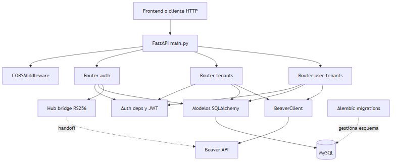
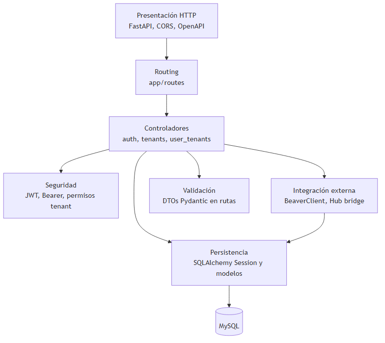
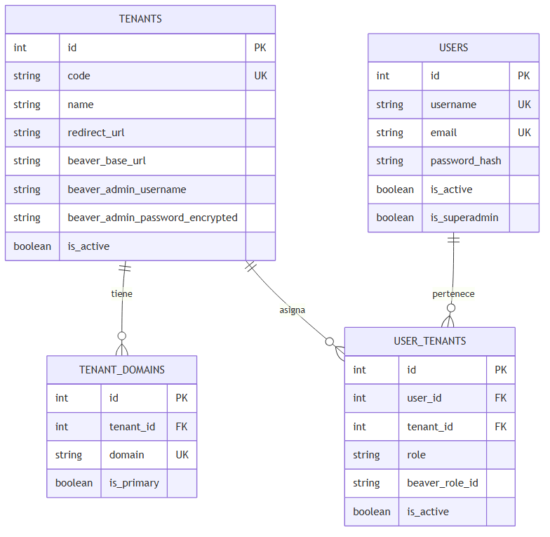
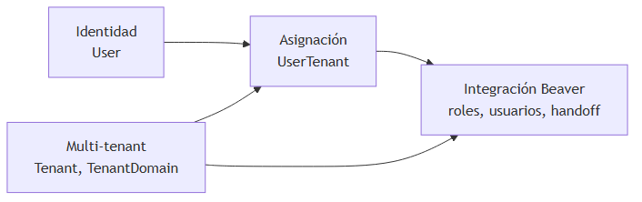
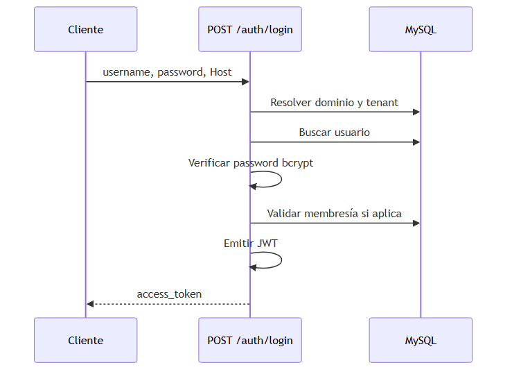
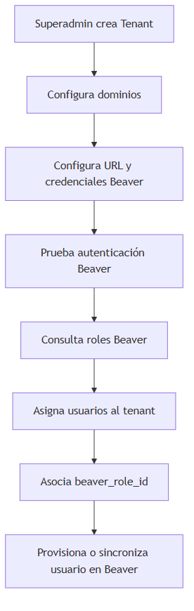
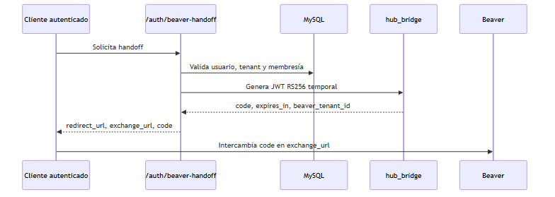

---
title: "Memoria Técnica Backend IotBack"
author: "Xercode / Desarrollo"
date: "2026"
toc: true
numbersections: true
---

# Memoria técnica del backend IotBack

Documento generado a partir de la inspección estática del código del backend ubicado en `IotBack`.

La carpeta `mqtt_router/` queda expresamente fuera del alcance de esta memoria, ya que corresponde a un proyecto independiente alojado en el mismo workspace por organización de desarrollo.

## 1. Introducción

IotBack es una API backend orientada a la gestión de un HUB multi-tenant para usuarios, tenants, dominios de acceso e integración con Beaver. El sistema permite autenticar usuarios, resolver el tenant asociado a un dominio, administrar tenants y usuarios desde un rol superadministrador, y coordinar operaciones de provisionamiento y handoff contra una instancia Beaver.

La memoria se ha elaborado exclusivamente mediante lectura del repositorio. No se han ejecutado migraciones, cambios de base de datos, instalaciones ni modificaciones de código fuente.

## 2. Objetivo del documento

El objetivo de este documento es describir de forma técnica y profesional el backend, incluyendo arquitectura, configuración, modelos de datos, esquemas de validación, endpoints, servicios internos, seguridad, despliegue y dependencias externas.

El documento diferencia:

- **Confirmado por código**: comportamiento, estructuras y dependencias presentes en los ficheros analizados.
- **Inferencia técnica**: conclusiones razonables deducidas por nombres, flujos o convenciones, pero no documentadas explícitamente en el código.

## 3. Alcance del backend

El backend cubre las siguientes áreas funcionales confirmadas por código:

- Autenticación de usuarios mediante `username` y password.
- Emisión y validación de JWT Bearer.
- Resolución de tenant a partir del header HTTP `Host`.
- Gestión de tenants, dominios asociados y estado activo/inactivo.
- Gestión administrativa de usuarios.
- Asociación de usuarios a tenants mediante roles internos.
- Asociación opcional de usuarios a roles de Beaver mediante `beaver_role_id`.
- Cifrado de credenciales técnicas Beaver por tenant.
- Prueba de autenticación técnica contra Beaver.
- Consulta de roles disponibles en Beaver.
- Provisionamiento, actualización, cambio de password y sincronización de roles de usuario en Beaver.
- Handoff desde el HUB hacia Beaver mediante token JWT RS256.
- Persistencia en MySQL mediante SQLAlchemy.
- Versionado de esquema mediante Alembic.
- Ejecución ASGI mediante Uvicorn y despliegue contenedorizado con Dockerfile.

Dentro del alcance principal analizado, la funcionalidad se concentra en la API HTTP, la persistencia relacional y la integración con Beaver. No se describen workers, colas, tareas programadas, cache externa ni almacenamiento de ficheros porque no forman parte del runtime principal documentado.

Fuera del alcance:

- `mqtt_router/`, considerado proyecto independiente.
- `venv/`, caches Python, ficheros HAR y artefactos locales de desarrollo.
- Documentos operativos auxiliares que no forman parte del runtime de la API.

## 4. Arquitectura general

La arquitectura sigue un esquema modular típico de FastAPI:

| Capa | Carpeta/fichero | Responsabilidad |
| --- | --- | --- |
| Entrada HTTP | `main.py` | Instancia `FastAPI`, registra CORS, monta routers y define endpoints auxiliares. |
| Endpoints | `app/routes/*.py` | Controladores HTTP para autenticación, tenants y asignaciones usuario-tenant. |
| Configuración | `app/core/config.py` | Carga variables de entorno y compone la URL de base de datos. |
| Seguridad | `app/core/security.py`, `app/core/deps.py` | Hash/verificación de password, JWT, usuario actual y permisos por tenant. |
| Cifrado | `app/core/encryption.py` | Cifrado y descifrado Fernet de credenciales técnicas Beaver. |
| Bridge Beaver | `app/core/hub_bridge.py` | Generación de token RS256 para handoff hacia Beaver. |
| Persistencia | `app/db/session.py` | Engine SQLAlchemy, sesiones y clase base declarativa. |
| Modelos ORM | `app/models/*.py` | Tablas SQLAlchemy del dominio multi-tenant. |
| Servicios externos | `app/services/beaver_client.py` | Cliente HTTP para operaciones contra Beaver. |
| Migraciones | `alembic/*` | Configuración y versiones Alembic. |

No existe una capa de repositorios separada. El acceso a datos se realiza directamente desde endpoints y servicios mediante `Session` de SQLAlchemy.

### 4.1 Arquitectura visual del backend

Confirmado por código: `main.py` crea la aplicación FastAPI, registra middleware CORS, incluye los routers de dominio y delega la operativa en modelos SQLAlchemy, dependencias de seguridad y servicios de integración con Beaver.



### 4.2 Diagrama de capas



Inferencia técnica: el backend funciona como capa de administración y federación entre un frontend propio, una base de datos local multi-tenant y servicios Beaver externos.

## 5. Estructura de directorios

Estructura principal confirmada:

```text
IotBack/
  main.py
  requirements.txt
  Dockerfile
  alembic.ini
  app/
    core/
      config.py
      deps.py
      encryption.py
      hub_bridge.py
      security.py
    db/
      session.py
    models/
      tenant.py
      tenant_domain.py
      user.py
      user_tenant.py
    routes/
      auth.py
      tenants.py
      user_tenants.py
    services/
      beaver_client.py
  alembic/
    env.py
    versións/
      d53bd0e2d398_initial_schema.py
      f03b39532183_expand_tenant_fields.py
      6c90d57d8e3f_beaver_model_alignment.py
  documentos_autologin/
```

También existen documentos auxiliares en raíz y en `documentos_autologin/` relacionados con runbooks, estrategia de bridge y validaciones manuales. Son útiles como contexto operativo, pero no forman parte directa de la ejecución de la API.

## 6. Tecnologías utilizadas

| Tecnologia | Versión confirmada | Uso |
| --- | --- | --- |
| Python | Según entorno / Docker `python:3.12-slim` | Lenguaje principal. |
| FastAPI | `0.120.4` | Framework web/API. |
| Uvicorn | `0.38.0` | Servidor ASGI. |
| SQLAlchemy | `2.0.44` | ORM y sesiones. |
| Alembic | `1.18.4` | Migraciones de base de datos. |
| PyMySQL | `1.1.2` | Driver MySQL. |
| Pydantic | `2.12.3` | DTOs y validación. |
| python-dotenv | `1.2.1` | Carga de `.env`. |
| python-jose | `3.5.0` | JWT HS256 y RS256. |
| passlib | `1.7.4` | Hash/verificación de passwords. |
| bcrypt | `4.0.1` | Backend bcrypt. |
| cryptography | `46.0.3` | Fernet y carga de claves privadas. |
| urllib.request | Libreria estándar | Cliente HTTP hacia Beaver. |

## 7. Configuración del entorno

La configuración se centraliza en `app/core/config.py`. El módulo carga `.env` desde la raíz del backend y expone la instancia `settings`.

Variables confirmadas:

| Variable | Obligatoria | Valor por defecto en código | Uso |
| --- | --- | --- | --- |
| `DB_HOST` | No | `127.0.0.1` | Host MySQL. |
| `DB_PORT` | No | `3306` | Puerto MySQL. |
| `DB_NAME` | No | `iotdb` | Nombre de base de datos. |
| `DB_USER` | No | `iotuser` | Usuario MySQL. |
| `DB_PASS` | No | `iotpass` | Password MySQL. |
| `SECRET_KEY` | Según entorno | Valor de desarrollo definido en código | Firma de JWT internos. |
| `JWT_ALGORITHM` | No | `HS256` | Algoritmo de JWT interno. |
| `ACCESS_TOKEN_EXPIRE_MINUTES` | No | `1440` | Duración del token interno. |
| `BEAVER_CREDENTIALS_ENCRYPTION_KEY` | Sí para Beaver | Vacío | Clave Fernet para credenciales técnicas por tenant. |
| `BEAVER_CLIENT_ID` | Sí para Beaver | Vacío | Client ID OAuth global de Beaver. |
| `BEAVER_CLIENT_SECRET` | Sí para Beaver | Vacío | Client secret OAuth global de Beaver. |
| `BEAVER_HTTP_TIMEOUT_SECONDS` | No | `10` | Timeout de llamadas HTTP a Beaver. |
| `HUB_BRIDGE_ISSUER` | No | `http://hub.local.test` | Emisor del token de handoff. |
| `HUB_BRIDGE_AUDIENCE` | No | `beaver-hub-bridge` | Audiencia del token de handoff. |
| `HUB_BRIDGE_PURPOSE` | No | `beaver_web_handoff` | Propósito declarado en el handoff. |
| `HUB_BRIDGE_TOKEN_TTL_SECONDS` | No | `120` | TTL del token de handoff. |
| `HUB_BRIDGE_BEAVER_TENANT_ID` | No | `default` | Tenant declarado hacia Beaver. |
| `HUB_BRIDGE_PRIVATE_KEY` | Alternativa | Vacío | Clave privada para firmar handoff. |
| `HUB_BRIDGE_PRIVATE_KEY_PATH` | Alternativa | Vacío | Ruta a clave privada para firmar handoff. |
| `DEFAULT_ADMIN_USERNAME` | No | `admin` | Seed de superadmin en migración inicial. |
| `DEFAULT_ADMIN_EMAIL` | No | `admin@local.dev` | Seed de superadmin en migración inicial. |
| `DEFAULT_ADMIN_PASSWORD` | No | `admin1234` | Seed de superadmin en migración inicial. |

La URL de base de datos se construye como:

```text
mysql+pymysql://{DB_USER}:{DB_PASS}@{DB_HOST}:{DB_PORT}/{DB_NAME}
```

## 8. Punto de entrada y ciclo de arranque

El punto de entrada confirmado es `main.py`.

Flujo de arranque:

1. Crea `app = FastAPI()`.
2. Registra `CORSMiddleware`.
3. Incluye los routers:
   - `app.routes.auth.router`
   - `app.routes.tenants.router`
   - `app.routes.user_tenants.router`
4. Expone endpoints auxiliares `GET /ping`, `GET /tenants` y `GET /whoami`.

El `Dockerfile` indica ejecución con:

```powershell
uvicorn main:app --host 0.0.0.0 --port 8000
```

Inferencia técnica: la API se ejecuta desde la raíz del backend para que `main.py` y el paquete `app` sean importables.

## 9. Base de datos

La base de datos confirmada es MySQL/MariaDB mediante SQLAlchemy y PyMySQL.

Ficheros relevantes:

- `app/db/session.py`: crea `engine`, `SessionLocal`, `Base` y dependencia `get_db()`.
- `alembic/env.py`: configura Alembic con `settings.SQLALCHEMY_DATABASE_URI` y `Base.metadata`.
- `app/models/*.py`: definen el modelo ORM.

Configuración SQLAlchemy:

```python
engine = create_engine(
    settings.SQLALCHEMY_DATABASE_URI,
    pool_pre_ping=True,
)
```

`pool_pre_ping=True` ayuda a detectar conexiónes MySQL cerradas antes de reutilizarlas.

Migraciones confirmadas:

| Revision | Nombre | Cambios principales |
| --- | --- | --- |
| `d53bd0e2d398` | `initial_schema` | Crea `tenants`, `users`, `tenant_domains`, `user_tenants` y siembra un superadmin. |
| `f03b39532183` | `expand_tenant_fields` | Agrega dirección, URL de redirección, URL base Beaver y `updated_at` a tenants. |
| `6c90d57d8e3f` | `beaver_model_alignment` | Ajusta email de usuarios, agrega credenciales Beaver y rol Beaver por asignación. |

## 10. Modelos principales

| Modelo ORM | Tabla | Campos principales | Observaciones |
| --- | --- | --- | --- |
| `Tenant` | `tenants` | `id`, `code`, `name`, `address`, `redirect_url`, `beaver_base_url`, `beaver_admin_username`, `beaver_admin_password_encrypted`, `is_active`, `created_at`, `updated_at` | Representa cada tenant gestiónado por el HUB. |
| `TenantDomain` | `tenant_domains` | `id`, `tenant_id`, `domain`, `is_primary`, `created_at` | Permite resolver tenant a partir del host HTTP. |
| `User` | `users` | `id`, `username`, `email`, `password_hash`, `is_active`, `is_superadmin`, `created_at`, `updated_at` | Identidad local autenticable mediante password. |
| `UserTenant` | `user_tenants` | `id`, `user_id`, `tenant_id`, `role`, `beaver_role_id`, `is_active`, `created_at`, `updated_at` | Relación many-to-many entre usuarios y tenants con rol interno y rol Beaver. |

Relaciónes clave confirmadas:

| Relación | Confirmado por código | Papel funcional |
| --- | --- | --- |
| `Tenant` -> `TenantDomain` | `tenant_domains.tenant_id` referencia `tenants.id`. | Un tenant puede tener uno o varios dominios. |
| `User` -> `UserTenant` | `user_tenants.user_id` referencia `users.id`. | Un usuario puede estar asignado a varios tenants. |
| `Tenant` -> `UserTenant` | `user_tenants.tenant_id` referencia `tenants.id`. | Un tenant puede contener varios usuarios. |
| `UserTenant` único por usuario y tenant | `UniqueConstraint("user_id", "tenant_id")`. | Evita duplicar asignaciones al mismo tenant. |

### 10.1 Modelo conceptual de datos



### 10.2 Resumen visual de entidades por dominio



## 11. Esquemas de validación

Los esquemas Pydantic están definidos dentro de los módulos de rutas, no en una carpeta `schemas/` separada.

| Fichero | Esquemas destacados | Uso |
| --- | --- | --- |
| `app/routes/auth.py` | `LoginRequest`, `BeaverHandoffRequest`, `BeaverHandoffResponse`, `UserCreate`, `UserUpdate`, `UserOut` | Login, usuario actual, handoff Beaver y gestión administrativa de usuarios. |
| `app/routes/tenants.py` | `TenantCreate`, `TenantUpdate`, `TenantOut`, `TenantDomainCreate`, `TenantDomainUpdate`, `BeaverAuthTestOut`, `BeaverRoleOut` | CRUD de tenants/dominios y operaciones Beaver de tenant. |
| `app/routes/user_tenants.py` | `UserTenantCreate`, `UserTenantUpdate`, `UserTenantOut`, `BeaverProvisionRequest`, `BeaverProvisionOut`, `BeaverUpdateOut`, `BeaverPasswordChangeOut` | Asignaciones usuario-tenant y operaciones Beaver por usuario. |

Validaciones confirmadas:

- `TenantCreate.beaver_mqtt_port` y `TenantUpdate.beaver_mqtt_port` se normalizan mediante `field_validator`.
- `beaver_mqtt_port` debe ser numérico y estar entre 1 y 65535.
- `normalize_domain()` limpia esquema, path, slash final y normaliza a minúsculas.
- Las actualizaciones parciales usan campos opcionales en DTOs tipo `TenantUpdate`, `TenantDomainUpdate`, `UserUpdate` y `UserTenantUpdate`.

## 12. Autenticación y autorización

La autenticación se basa en Bearer Token con JWT.

Ficheros:

- `app/core/security.py`: hash bcrypt, verificación de password y creación de JWT.
- `app/core/deps.py`: dependencia `get_current_user`.
- `app/routes/auth.py`: endpoint de login y endpoints administrativos de usuarios.

### 12.1 Flujo de login

`POST /auth/login`:

1. Lee el header `Host`.
2. Busca un dominio en `tenant_domains`.
3. Si el dominio existe, valida que el tenant asociado esté activo.
4. Busca el usuario por `username`.
5. Verifica password contra `password_hash`.
6. Determina el contexto de tenant y rol:
   - Superadmin: acceso global, con tenant del dominio si existe.
   - Usuario normal con dominio: requiere asignación activa al tenant.
   - Usuario normal sin dominio: si tiene una sola asignación activa, usa ese tenant; si tiene varias, queda en contexto sin tenant concreto.
7. Emite JWT con `sub`, `username`, `tenant_id`, `role` e `is_superadmin`.



### 12.2 Usuario actual

`get_current_user`:

1. Requiere `Authorization: Bearer <token>`.
2. Decodifica JWT con `SECRET_KEY` y `JWT_ALGORITHM`.
3. Recupera usuario activo desde base de datos.
4. Si no es superadmin, valida que exista una asignación `UserTenant` activa para el tenant del token.
5. Devuelve un diccionario con usuario, email, tenant, rol e indicador de superadmin.

### 12.3 Mapa de actores y permisos

| Actor | Descripción | Permisos confirmados |
| --- | --- | --- |
| Usuario no autenticado | Cliente sin JWT. | Login, ping, resolución pública de host y endpoint público de tenants definido en `main.py`. |
| Usuario autenticado | Usuario activo con JWT válido. | Consultar su identidad, listar tenants activos y dominios, consultar tenant, iniciar handoff Beaver si no es superadmin. |
| Superadmin | Usuario con `is_superadmin=True`. | Administrar usuarios, tenants, dominios, asignaciones usuario-tenant y operaciones Beaver administrativas. |
| Servicio Beaver | Sistema externo. | Recibe operaciones HTTP autenticadas con credenciales técnicas configuradas por tenant. |

### 12.4 Matriz actor / funcionalidad

| Funcionalidad | Público | Usuario | Superadmin |
| --- | --- | --- | --- |
| Login | Sí | - | - |
| Consultar usuario actual | No | Sí | Sí |
| Listar tenants activos del router | No | Sí | Sí |
| Crear/editar/desactivar tenant | No | No | Sí |
| Gestionar dominios | No | Consulta | Sí |
| Gestionar usuarios | No | No | Sí |
| Gestionar asignaciones usuario-tenant | No | No | Sí |
| Probar auth Beaver | No | No | Sí |
| Listar roles Beaver | No | No | Sí |
| Provisionar usuario en Beaver | No | No | Sí |
| Handoff Beaver | No | Sí, si aplica | No |

## 13. Endpoints disponibles

### 13.1 Salud y resolución de tenant

| Método | Ruta | Fichero | Propósito | Auth |
| --- | --- | --- | --- | --- |
| GET | `/ping` | `main.py` | Health check simple. | No |
| GET | `/whoami` | `main.py` | Resuelve tenant por `Host` y devuelve datos básicos. | No |
| GET | `/tenants` | `main.py` | Lista tenants sin response model. | No |

Nota: también existe `GET /tenants/` en el router de tenants con autenticación. En esta memoria se documentan ambas rutas porque forman parte de la superficie HTTP disponible.

### 13.2 Autenticación y usuarios

| Método | Ruta | Fichero | Propósito | Auth |
| --- | --- | --- | --- | --- |
| POST | `/auth/login` | `app/routes/auth.py` | Autentica usuario y devuelve JWT. | No |
| GET | `/auth/me` | `app/routes/auth.py` | Devuelve usuario actual. | Bearer |
| POST | `/auth/beaver-handoff` | `app/routes/auth.py` | Genera código/token de handoff hacia Beaver. | Bearer, no superadmin |
| GET | `/auth/users` | `app/routes/auth.py` | Lista usuarios con tenants asociados. | Superadmin |
| POST | `/auth/user` | `app/routes/auth.py` | Crea usuario. | Superadmin |
| GET | `/auth/user/{user_id}` | `app/routes/auth.py` | Consulta usuario por ID. | Superadmin |
| POST | `/auth/user/{user_id}` | `app/routes/auth.py` | Actualiza usuario por ID. | Superadmin |

### 13.3 Tenants y dominios

| Método | Ruta | Fichero | Propósito | Auth |
| --- | --- | --- | --- | --- |
| GET | `/tenants/` | `app/routes/tenants.py` | Lista tenants activos con dominios. | Bearer |
| POST | `/tenants/` | `app/routes/tenants.py` | Crea tenant y cifra password Beaver si se informa. | Superadmin |
| GET | `/tenants/{tenant_id}` | `app/routes/tenants.py` | Consulta tenant. | Bearer |
| PUT | `/tenants/{tenant_id}` | `app/routes/tenants.py` | Actualiza tenant. | Superadmin |
| DELETE | `/tenants/{tenant_id}` | `app/routes/tenants.py` | Desactiva tenant. | Superadmin |
| GET | `/tenants/{tenant_id}/domains` | `app/routes/tenants.py` | Lista dominios de tenant. | Bearer |
| POST | `/tenants/{tenant_id}/domains` | `app/routes/tenants.py` | Crea dominio. | Superadmin |
| GET | `/tenants/{tenant_id}/domains/{domain_id}` | `app/routes/tenants.py` | Consulta dominio. | Bearer |
| PUT | `/tenants/{tenant_id}/domains/{domain_id}` | `app/routes/tenants.py` | Actualiza dominio. | Superadmin |
| DELETE | `/tenants/{tenant_id}/domains/{domain_id}` | `app/routes/tenants.py` | Elimina dominio. | Superadmin |

### 13.4 Integración Beaver por tenant

| Método | Ruta | Fichero | Propósito | Auth |
| --- | --- | --- | --- | --- |
| POST | `/tenants/{tenant_id}/beaver/test-auth` | `app/routes/tenants.py` | Valida credenciales técnicas del tenant contra Beaver. | Superadmin |
| GET | `/tenants/{tenant_id}/beaver/roles` | `app/routes/tenants.py` | Consulta roles disponibles en Beaver. | Superadmin |

### 13.5 Asignaciones usuario-tenant

| Método | Ruta | Fichero | Propósito | Auth |
| --- | --- | --- | --- | --- |
| GET | `/users/{user_id}/tenants` | `app/routes/user_tenants.py` | Lista asignaciones del usuario. | Superadmin |
| POST | `/users/{user_id}/tenants` | `app/routes/user_tenants.py` | Crea asignación usuario-tenant. | Superadmin |
| PUT | `/users/{user_id}/tenants/{tenant_id}` | `app/routes/user_tenants.py` | Actualiza rol, rol Beaver y estado. | Superadmin |
| DELETE | `/users/{user_id}/tenants/{tenant_id}` | `app/routes/user_tenants.py` | Elimina asignación. | Superadmin |

### 13.6 Integración Beaver por usuario

| Método | Ruta | Fichero | Propósito | Auth |
| --- | --- | --- | --- | --- |
| POST | `/users/{user_id}/tenants/{tenant_id}/beaver/provision` | `app/routes/user_tenants.py` | Crea/localiza usuario en Beaver y asocia rol. | Superadmin |
| PUT | `/users/{user_id}/tenants/{tenant_id}/beaver/update` | `app/routes/user_tenants.py` | Actualiza datos básicos de usuario en Beaver. | Superadmin |
| PUT | `/users/{user_id}/tenants/{tenant_id}/beaver/change-password` | `app/routes/user_tenants.py` | Cambia password de usuario en Beaver. | Superadmin |

### 13.7 Flujo funcional de administración tenant



### 13.8 Flujo de handoff hacia Beaver



### 13.9 Trazabilidad técnica por área funcional

| Área funcional | Endpoints | Modelos | Servicios |
| --- | --- | --- | --- |
| Autenticación | `/auth/login`, `/auth/me` | `User`, `UserTenant`, `TenantDomain`, `Tenant` | `security.py`, `deps.py` |
| Tenants | `/tenants/*` | `Tenant`, `TenantDomain` | `encryption.py`, `BeaverClient` |
| Usuarios | `/auth/users`, `/auth/user/*` | `User`, `UserTenant`, `Tenant` | `security.py` |
| Asignaciones | `/users/{user_id}/tenants/*` | `UserTenant`, `User`, `Tenant` | `BeaverClient` |
| Beaver | `/beaver/*`, `/auth/beaver-handoff` | `Tenant`, `User`, `UserTenant` | `BeaverClient`, `hub_bridge.py` |

## 14. Servicios internos y lógica de negocio

| Servicio / módulo | Responsabilidad |
| --- | --- |
| `app.core.security` | Verifica passwords, genera hashes bcrypt y crea JWT internos. |
| `app.core.deps` | Resuelve usuario actual desde Bearer token y valida pertenencia a tenant. |
| `app.core.encryption` | Cifra y descifra secretos con Fernet. |
| `app.core.hub_bridge` | Carga clave privada, genera JWT RS256 de handoff y construye URL de exchange. |
| `app.services.beaver_client` | Ejecuta autenticación OAuth y operaciones de usuario/rol contra Beaver. |

`BeaverClient` encapsula las rutas externas:

| Operación | Ruta Beaver usada |
| --- | --- |
| Obtener token | `/oauth2/token` |
| Crear miembro | `/user/members` |
| Buscar miembros | `/user/members/search` |
| Actualizar miembro | `/user/members/{user_id}` |
| Cambiar password | `/user/members/{user_id}/change-password` |
| Asociar rol | `/user/roles/{role_id}/associate-user` |
| Desasociar rol | `/user/roles/{role_id}/disassociate-user` |
| Buscar roles | `/user/roles/search` |

El cliente HTTP usa credenciales técnicas almacenadas por tenant y credenciales OAuth globales configuradas por entorno.

## 15. Gestión de errores

La gestión de errores se basa en `HTTPException` de FastAPI y excepciones específicas en el cliente Beaver.

| Código | Uso confirmado |
| --- | --- |
| 400 | Validaciones funcionales, duplicados, configuración incompleta o datos no aptos. |
| 401 | Credenciales inválidas, token no válido o usuario inválido. |
| 403 | Acceso no autorizado, usuario sin tenant o no superadmin. |
| 404 | Usuario, tenant, dominio o asignación inexistentes. |
| 500 | Error interno de configuración/cifrado/handoff. |
| 502 | Error de autenticación o respuesta no válida desde Beaver. |
| 504 | Error de conexión o timeout hacia Beaver. |

La API utiliza el mecanismo estándar de excepciones HTTP de FastAPI para expresar errores funcionales y técnicos.

## 16. Seguridad

Controles confirmados:

| Control | Implementación |
| --- | --- |
| Passwords locales | Hash bcrypt mediante passlib. |
| JWT internos | Firma con `SECRET_KEY` y algoritmo configurable. |
| Bearer auth | `HTTPBearer()` en `app/core/deps.py`. |
| Autorización por tenant | Validación de `UserTenant` activo para usuarios no superadmin. |
| Superadmin | Campo `is_superadmin` en `users` y dependencias `superadmin_required`. |
| Credenciales Beaver | Password técnico cifrado con Fernet. |
| Handoff Beaver | JWT RS256 firmado con clave privada. |
| CORS | Middleware CORS configurado en el arranque de FastAPI. |

Las claves y credenciales necesarias para operar el sistema se proporcionan mediante variables de entorno.

## 17. Logging y observabilidad

La observabilidad de aplicación se apoya principalmente en la salida estándar del servidor ASGI y en los códigos de respuesta HTTP.

Observabilidad confirmada:

- Logs estándar de Uvicorn/FastAPI en runtime.
- Configuración de logging de Alembic en `alembic.ini`.
- Códigos HTTP y mensajes de error mediante `HTTPException`.

La memoria describe la observabilidad disponible desde la estructura actual del backend y su configuración de ejecución.

## 18. Despliegue y ejecución

El proyecto incluye `Dockerfile`.

Proceso confirmado:

1. Imagen base `python:3.12-slim`.
2. Instalación de dependencias de sistema para compilación y cliente MySQL.
3. Instalación de dependencias Python desde `requirements.txt`.
4. Copia del código fuente.
5. Exposición del puerto 8000.
6. Arranque con Uvicorn.

Comando de arranque definido en Docker:

```powershell
uvicorn main:app --host 0.0.0.0 --port 8000
```

Migraciones esperables:

```powershell
alembic upgrade head
```

Inferencia técnica: antes de arrancar la API en un entorno nuevo debe existir la base de datos MySQL y deben aplicarse las migraciones Alembic.

## 19. Dependencias externas

| Dependencia externa | Uso |
| --- | --- |
| MySQL/MariaDB | Persistencia principal del backend. |
| Beaver API | Autenticación técnica, roles, provisionamiento, actualización de usuarios y handoff. |
| Clave privada RS256 | Firma del token temporal de handoff hacia Beaver. |

## 20. Consideraciones de entrega

Esta memoria describe el backend a nivel funcional y técnico, con foco en la estructura entregable del sistema: API HTTP, persistencia, autenticación, gestión multi-tenant e integración con Beaver.

| Ámbito | Consideración |
| --- | --- |
| Configuración | El backend se parametriza mediante variables de entorno para base de datos, JWT, cifrado, credenciales Beaver y bridge de handoff. |
| Base de datos | La estructura relacional se versiona mediante Alembic y se apoya en MySQL/MariaDB. |
| Integración Beaver | Las operaciones con Beaver se concentran en `BeaverClient` y usan credenciales técnicas configuradas por tenant. |
| Seguridad | La autenticación interna usa JWT Bearer y la autorización se basa en superadmin y asignaciones usuario-tenant. |
| Despliegue | El proyecto incluye Dockerfile y arranque ASGI con Uvicorn. |
| Documentación | El documento fuente Markdown conserva diagramas Mermaid y puede exportarse a DOCX mediante el pipeline incluido en `docs/build/`. |

## 21. Resumen ejecutivo final

IotBack es un backend FastAPI que actúa como HUB multi-tenant para gestionar usuarios, tenants, dominios y operaciones de integración con Beaver. Su diseño actual es sencillo y directo: routers por área funcional, modelos SQLAlchemy, configuración por entorno, autenticación JWT y servicios específicos para Beaver.

La funcionalidad principal confirmada cubre login, contexto tenant por dominio, administración de tenants y usuarios, asignaciones usuario-tenant, provisionamiento y sincronización con Beaver, y handoff firmado mediante RS256.

La solución queda documentada como una API backend modular, con separación entre rutas HTTP, seguridad, modelos ORM, configuración, persistencia e integración externa. Esta estructura facilita su comprensión por parte de equipo técnico, cliente o responsables de mantenimiento.


