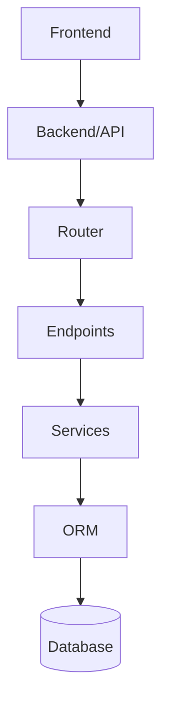

# How to generate memoria tecnica completa

Este documento contiene prompts reutilizables para pedir a Codex/ChatGPT que replique el proceso completo realizado en este proyecto:

1. Analizar un backend/proyecto.
2. Generar una memoria tecnica profesional en Markdown.
3. Enriquecerla con tablas, arquitectura, relaciones, actores, permisos y diagramas Mermaid.
4. Crear una estructura `docs/`.
5. Montar un pipeline reproducible Markdown + Mermaid CLI + Pandoc.
6. Exportar un DOCX final con diagramas renderizados.

El ejemplo real usado como referencia fue:

```text
E:\DEVELOVEMENTS\2025\PLAYCARDS\canasta\playcard-backend
```

## Herramientas necesarias

Herramientas recomendadas en Windows:

| Herramienta | Uso | Comando de comprobacion |
| --- | --- | --- |
| Pandoc | Convertir Markdown a DOCX/PDF | `where pandoc` |
| Node.js / npm | Instalar Mermaid CLI | `node -v` / `npm -v` |
| Mermaid CLI | Renderizar bloques Mermaid a SVG/PNG | `where mmdc` |
| PowerShell | Ejecutar scripts de build | Incluido en Windows |
| Git | Control de cambios y verificacion | `git status --short` |

Instalacion de Mermaid CLI:

```powershell
npm install -g @mermaid-js/mermaid-cli
```

Comprobacion:

```powershell
where mmdc
```

Pandoc debe estar instalado previamente. Comprobacion:

```powershell
where pandoc
```

Nota importante: Pandoc DOCX no renderiza Mermaid directamente. El proceso correcto es:

```text
Markdown fuente
-> detectar bloques Mermaid
-> renderizar Mermaid a imagenes
-> crear Markdown temporal con imagenes
-> ejecutar Pandoc
-> generar DOCX
```

## Prompt 1: generar memoria tecnica inicial

Usa este prompt cuando quieras analizar un proyecto desde cero y generar una memoria tecnica completa.

Sustituye:

- `RUTA_DEL_PROYECTO`
- `RUTA_ARCHIVO_SALIDA`
- `NOMBRE_DEL_PROYECTO`
- tecnologias esperadas si las conoces

```text
NECESITO GENERAR UNA MEMORIA TECNICA COMPLETA Y PROFESIONAL DEL BACKEND/PROYECTO.

Proyecto a analizar:
E:\DEVELOVEMENTS\2025\XERCODE\IOT\PROYECTO\WEB_HUB\IotBack

Archivo de salida obligatorio:
E:\DEVELOVEMENTS\2025\XERCODE\IOT\PROYECTO\WEB_HUB\IotBack\Docs

REGLAS ESTRICTAS:
- NO modificar codigo existente.
- NO refactorizar.
- NO crear migraciones.
- NO ejecutar cambios sobre base de datos.
- NO cambiar configuraciones.
- NO instalar dependencias.
- SOLO leer, analizar y documentar.
- La unica escritura permitida es crear o sobrescribir el archivo de memoria tecnica indicado.
- Si detectas dudas o inconsistencias, documentalas en una seccion de "Riesgos, dudas y puntos pendientes", pero no corrijas nada.

OBJETIVO:
Generar una memoria tecnica completa, profesional y bien estructurada del proyecto, apta para entregar a cliente, equipo tecnico o auditoria interna.

DEBES ANALIZAR DETALLADAMENTE:
- Estructura general del proyecto.
- Framework usado.
- Punto de entrada de la aplicacion.
- Configuracion principal.
- Variables de entorno esperadas.
- Sistema de autenticacion y autorizacion.
- Organizacion de routers/endpoints/controladores.
- Modelos de datos.
- Esquemas/DTOs/validadores.
- Servicios internos.
- Repositorios o capa de acceso a datos.
- Migraciones, si existen.
- Dependencias principales.
- Integracion con base de datos.
- Middleware.
- CORS.
- Gestion de errores.
- Logging.
- Seguridad.
- Flujo de arranque.
- Flujo de despliegue si puede deducirse, sin inventar.
- Scripts auxiliares.
- Tests, si existen.
- Relacion entre modulos.
- Funcionalidades principales del proyecto.

ESTRUCTURA MINIMA DEL DOCUMENTO:

# Memoria tecnica del backend/proyecto NOMBRE_DEL_PROYECTO

## 1. Introduccion
## 2. Objetivo del documento
## 3. Alcance del backend/proyecto
## 4. Arquitectura general
## 5. Estructura de directorios
## 6. Tecnologias utilizadas
## 7. Configuracion del entorno
## 8. Punto de entrada y ciclo de arranque
## 9. Base de datos / persistencia
## 10. Modelos principales
## 11. Esquemas de validacion / DTOs
## 12. Autenticacion y autorizacion
## 13. Endpoints, comandos o interfaces disponibles
Para cada endpoint/interfaz documentar:
- Metodo HTTP o tipo de interfaz
- Ruta/comando/nombre
- Fichero donde esta definido
- Proposito
- Parametros/path/query/body si se pueden deducir
- Respuesta esperada si se puede deducir
- Dependencias internas relevantes
## 14. Servicios internos y logica de negocio
## 15. Gestion de errores
## 16. Seguridad
## 17. Logging y observabilidad
## 18. Despliegue y ejecucion
## 19. Dependencias externas
## 20. Riesgos tecnicos detectados
## 21. Puntos pendientes o dudas
## 22. Recomendaciones tecnicas
## 23. Resumen ejecutivo final

REQUISITOS DE CALIDAD:
- No hacer una descripcion superficial.
- Citar nombres reales de carpetas, archivos, clases y funciones cuando proceda.
- Explicar el papel de cada modulo importante.
- Diferenciar claramente entre lo que esta confirmado por codigo y lo que es inferencia tecnica.
- Mantener tono tecnico, profesional y claro.
- Usar Markdown limpio.
- Incluir tablas cuando ayuden, especialmente para endpoints, modelos, variables de entorno y dependencias.
- No inventar funcionalidades que no esten en el codigo.
- Si algo no puede confirmarse, indicarlo expresamente.

PROCESO DE TRABAJO:
1. Primero inspecciona la estructura completa del proyecto.
2. Despues identifica archivos clave: main/entrypoint, config, database, routers, models, schemas, services, auth, migrations y requirements/package/pyproject.
3. Analiza endpoints, modelos y dependencias.
4. Redacta la memoria completa.
5. Guarda el resultado en el archivo indicado.
6. Al finalizar, muestra un resumen de lo generado y confirma que no se ha modificado ningun otro archivo.

Antes de escribir el archivo final, genera internamente un indice razonado de secciones, pero NO me preguntes confirmacion salvo que sea imposible continuar.
```

## Prompt 2: enriquecer memoria con diagramas y flujos

Usa este prompt despues de tener una primera memoria tecnica. Sirve para añadir Mermaid, actores, permisos, estados, relaciones y trazabilidad.

```text
NECESITO MEJORAR LA MEMORIA TECNICA EXISTENTE, AÑADIENDO ESQUEMAS, RELACIONES ENTRE ENTIDADES Y FLUJOS FUNCIONALES.

Proyecto:
E:\DEVELOVEMENTS\2025\XERCODE\IOT\PROYECTO\WEB_HUB\IotBack

Documento existente:
E:\DEVELOVEMENTS\2025\XERCODE\IOT\PROYECTO\WEB_HUB\IotBack\Docs\memoria_tecnica_iotback.md

REGLAS ESTRICTAS:
- NO modificar codigo fuente.
- NO refactorizar.
- NO crear migraciones.
- NO tocar configuracion.
- NO instalar dependencias.
- NO ejecutar cambios sobre base de datos.
- La unica escritura permitida es actualizar el archivo de memoria tecnica.
- Mantener el contenido existente salvo que sea necesario reordenar o mejorar la coherencia documental.
- No inventar funcionalidades no confirmadas por codigo.
- Diferenciar siempre entre "confirmado por codigo" e "inferencia tecnica".
- NO documentar despliegue productivo real del servidor en profundidad si se hara en otro documento.

OBJETIVO:
Elevar la memoria tecnica actual para que sea mas profesional, visual y comprensible, añadiendo:

1. Esquemas de arquitectura.
2. Diagrama de capas.
3. Diagrama de relaciones principales entre modelos.
4. Flujos funcionales del sistema.
5. Flujos de autenticacion.
6. Flujo completo de ciclo de vida del dominio principal.
7. Flujo de configuraciones iniciales o preparatorias.
8. Flujo de generacion/procesamiento principal.
9. Flujo de registro de resultados o persistencia principal.
10. Flujo de cierre/calculo/resumen si aplica.
11. Mapa de actores y permisos.
12. Tabla de trazabilidad entre actores, endpoints y modulos.
13. Resumen visual de estados principales.

FORMATO:
Usar Markdown profesional.

Cuando sea util, usar diagramas Mermaid compatibles con Markdown:



IMPORTANTE:
- Los diagramas Mermaid deben ser simples, legibles y no excesivamente grandes.
- Si un diagrama se vuelve demasiado complejo, dividirlo en varios diagramas pequeños.
- Los Mermaid deben permanecer como bloques Mermaid en el Markdown fuente.

SECCIONES A AÑADIR O MEJORAR:

Arquitectura visual:
- Diagrama general de capas.
- Explicacion breve de cada capa.
- Relacion entre cliente/frontend, API, servicios, ORM y base de datos.

Mapa de actores y permisos:
- Administrador.
- Usuario operativo o rol tecnico si existe.
- Usuario final.
- Usuario publico/no autenticado.

Para cada actor indicar:
- Responsabilidad funcional.
- Tipo de autenticacion.
- Endpoints principales que puede usar.
- Restricciones relevantes.

Modelo conceptual de datos:
- Diagrama Mermaid ER simplificado.
- Explicacion de entidades principales.
- Relaciones clave.
- Ajustar estrictamente a los modelos reales.

Ciclo de vida funcional:
- Creacion de entidad principal.
- Configuracion.
- Participantes/usuarios.
- Procesamiento.
- Resultados.
- Cierre/finalizacion.
- Consulta/resumen.

Estados:
- Tabla de estados.
- Transiciones permitidas si pueden deducirse.
- Endpoints o funciones que provocan cambios de estado.
- Diagrama stateDiagram-v2 si aplica.

Flujos:
- Autenticacion.
- Configuracion inicial.
- Proceso principal.
- Registro de resultados o cambios.
- Calculo/consulta de resumen.

Matriz actor / funcionalidad:
Crear tabla tipo:

Funcionalidad | Publico | Usuario final | Operador | Admin
Consultar informacion publica | Si | Si | Si | Si
Crear entidad principal | No | No | No/Si segun codigo | Si
Registrarse/inscribirse | No | Si | No | No
Gestion operativa | No | No | Si | Si

Ajustar estrictamente a lo observado en dependencias reales.

Trazabilidad tecnica:
Añadir tabla que relacione:

Area funcional | Endpoints/interfaz | Modelos implicados | Servicios implicados

NO HAY QUE HACER:
- No crear documento separado.
- No eliminar la seccion actual de riesgos.
- No suavizar riesgos tecnicos.
- No convertir recomendaciones tecnicas en tareas de codigo.
- No tocar nada fuera del Markdown de memoria tecnica.

CRITERIO DE CALIDAD:
La memoria resultante debe ser comprensible para:
- Un desarrollador que herede el proyecto.
- Un responsable tecnico.
- Un auditor interno.
- Un cliente con cierta capacidad tecnica.

IMPORTANTE:
Esta es una segunda pasada de enriquecimiento documental. No reescribas masivamente la memoria existente si no es necesario. Añade secciones nuevas y mejora transiciones, pero conserva la informacion tecnica ya analizada.

Al finalizar:
- Mostrar resumen de secciones añadidas.
- Confirmar que solo se ha modificado el Markdown de memoria tecnica.
```

## Prompt 3: crear pipeline docs + Pandoc + Mermaid

Usa este prompt cuando ya exista la memoria Markdown y quieras crear el sistema reproducible para exportar a DOCX.

```text
OBJETIVO:
Reestructurar la documentacion tecnica para implantar un sistema reutilizable de generacion automatica DOCX/PDF basado en Markdown + Pandoc + Mermaid.

CONTEXTO:
Actualmente existe el archivo:

E:\DEVELOVEMENTS\2025\XERCODE\IOT\PROYECTO\WEB_HUB\IotBack\Docs\memoria_tecnica_iotback.md

El objetivo es mover esta documentacion a una estructura profesional basada en:
- docs/
- build reproducible
- exports
- Mermaid renderizado
- Pandoc DOCX

IMPORTANTE:
Ya existe Pandoc funcionando en otros proyectos o debe detectarse.
Es aceptable usar Mermaid CLI mediante npm si ya esta instalado o indicar como instalarlo.

REGLAS ESTRICTAS:
- NO modificar codigo fuente.
- NO refactorizar.
- NO tocar endpoints/modelos/logica.
- SOLO trabajar sobre documentacion y scripts de build.
- NO reescribir masivamente la memoria actual.
- Mantener contenido tecnico existente.
- NO eliminar diagramas Mermaid actuales.
- NO convertir Mermaid a imagenes manualmente dentro del markdown fuente.
- Los Mermaid deben seguir siendo Mermaid en el fuente original.

OBJETIVO FUNCIONAL:
Implantar pipeline:

Markdown fuente
-> build temporal
-> render Mermaid
-> DOCX final Pandoc

Resultado esperado:

docs/
├── MEMORIA_TECNICA_BACKEND.md
├── build/
├── exports/
├── assets/
├── assets/diagramas/
├── assets/img/
├── generated/
│   └── diagrams/
├── build/build-docx.ps1
├── build/build-pdf.ps1 opcional
├── build/reporte-build.md
├── exports/MEMORIA_TECNICA_BACKEND.docx
├── reference.docx opcional

TRABAJO A REALIZAR:

1. Crear carpeta docs en la raiz del proyecto.
2. Mover la memoria tecnica a docs/MEMORIA_TECNICA_BACKEND.md.
3. Crear estructura completa de build indicada arriba.
4. Crear script principal:

docs/build/build-docx.ps1

MERMAID:

Pandoc DOCX no renderiza Mermaid automaticamente.

Por tanto el pipeline debe:

1. Detectar bloques:

```mermaid
...
```

2. Extraerlos temporalmente.
3. Generar SVG usando Mermaid CLI (`mmdc`).
4. Si Pandoc no puede incrustar SVG porque falta `rsvg-convert`, generar tambien PNG fallback y usar PNG en el Markdown temporal.
5. Sustituir cada bloque Mermaid por imagen Markdown temporal.
6. Generar un Markdown temporal de build.
7. Ejecutar Pandoc sobre el Markdown temporal.

El Markdown fuente original:

E:\DEVELOVEMENTS\2025\XERCODE\IOT\PROYECTO\WEB_HUB\IotBack\Docs\memoria_tecnica_iotback.md

NO debe modificarse durante el build.

MERMAID CLI:

Si Mermaid CLI no esta instalado:

- Detectarlo.
- Mostrar mensaje indicando:

```powershell
npm install -g @mermaid-js/mermaid-cli
```

- NO instalar automaticamente salvo permiso explicito.

SCRIPT build-docx.ps1:

Debe:

- Detectar correctamente rutas relativas.
- Leer docs/MEMORIA_TECNICA_BACKEND.md.
- Detectar todos los bloques Mermaid.
- Generar:
  - generated/diagrams/*.svg
  - generated/diagrams/*.png si falta rsvg-convert o si se decide usar fallback para DOCX.
- Crear Markdown temporal:
  - build/build-unificado.md
- Sustituir cada Mermaid por imagen Markdown temporal.
- Ejecutar Pandoc.

PANDOC:

Usar:

```powershell
pandoc build/build-unificado.md -o exports/MEMORIA_TECNICA_IOT-HUB-BACKEND.docx --toc --toc-depth=2 --number-sections
```

Si existe:

```text
reference.docx
```

usar tambien:

```powershell
--reference-doc=reference.docx
```

Si NO existe:
continuar igualmente sin fallar.

YAML FRONTMATTER:

Añadir al inicio del Markdown SI NO EXISTE YA:

```yaml
---
title: "Memoria Tecnica Backend HUB IOT XERCODE V.1."
author: "FreshSoftware / Desarrollo"
date: "2026"
toc: true
numbersections: true
---
```

NO duplicarlo si ya existe.

BUILD TEMPORAL:

El archivo:

build/build-unificado.md

es artefacto generado.

NO debe editarse manualmente.
Debe poder borrarse y regenerarse.

GENERACION PDF:

Opcionalmente crear:

build/build-pdf.ps1

solo si el entorno Pandoc/LaTeX ya esta disponible.
NO instalar LaTeX automaticamente.

VALIDACIONES:

Crear:

build/reporte-build.md

Incluyendo:

- Mermaid detectados.
- SVG generados.
- PNG generados si aplica.
- Errores de render.
- Rutas usadas.
- Estado de Pandoc.
- Estado de Mermaid CLI.
- Estado de rsvg-convert si aplica.
- DOCX generado.

.gitignore:

Si existe .gitignore añadir:

```text
docs/build/build-unificado.md
docs/exports/*.docx
docs/exports/*.pdf
docs/generated/diagrams/*.svg
docs/generated/diagrams/*.png
```

SIN romper reglas existentes.

COMANDO FINAL ESPERADO:

Debe funcionar:

```powershell
cd docs
.\build\build-docx.ps1
```

Y generar:

```text
docs/exports/MEMORIA_TECNICA_IOT-HUB-BACKEND.docx
```

IMPORTANTE:
- NO rehacer la memoria.
- NO compactar contenido.
- NO cambiar el tono.
- NO cambiar headings salvo necesidad tecnica.
- NO modificar codigo fuente.
- NO tocar migraciones ni configuraciones del proyecto.

Este trabajo es SOLO:
- pipeline documental,
- estructura docs,
- Mermaid -> SVG/PNG,
- Pandoc DOCX,
- build reproducible.

INFORME FINAL:

Al finalizar informar:
- Carpetas creadas.
- Scripts creados.
- Mermaid detectados.
- SVG generados.
- PNG generados si aplica.
- Ruta DOCX final.
- Comando exacto de generacion.
- Dependencias necesarias detectadas.
- Advertencias pendientes.
```

## Prompt 4: ejecutar build DOCX cuando ya estan las herramientas

Usa este prompt cuando ya hayas instalado Mermaid CLI y quieras generar el DOCX.

```text
Ya he instalado Mermaid CLI con:

npm install -g @mermaid-js/mermaid-cli

Por favor ejecuta el build:

cd RUTA_DEL_PROYECTO/docs
.\build\build-docx.ps1 -Clean

Si falla por permisos de Node/Mermaid CLI global, vuelve a intentarlo con permisos escalados.

Al finalizar informa:
- Mermaid detectados.
- SVG generados.
- PNG fallback generados si aplica.
- Errores de render.
- Estado de Pandoc.
- Ruta del DOCX final.
- Ruta del reporte de build.

No modifiques codigo fuente.
```

## Prompt 5: revisar resultado y advertencias

Usa este prompt si el DOCX se genera pero hay avisos o quieres verificar que todo este correcto.

```text
Revisa el resultado del pipeline documental.

Proyecto:
RUTA_DEL_PROYECTO

Archivos:
- docs/build/reporte-build.md
- docs/exports/MEMORIA_TECNICA_BACKEND.docx
- docs/generated/diagrams/

Necesito que confirmes:
- Si el DOCX existe.
- Tamaño del DOCX.
- Cuantos Mermaid se detectaron.
- Cuantos SVG se generaron.
- Cuantos PNG se generaron.
- Si hubo errores de render.
- Si Pandoc genero warnings.
- Si falta alguna dependencia opcional como rsvg-convert.

No modifiques codigo fuente.
Si hay que ajustar el script de build, toca solo docs/build/build-docx.ps1 y .gitignore si hace falta.
```

## Estructura final recomendada

```text
proyecto/
├── docs/
│   ├── MEMORIA_TECNICA_BACKEND.md
│   ├── assets/
│   │   ├── diagramas/
│   │   └── img/
│   ├── build/
│   │   ├── build-docx.ps1
│   │   ├── build-unificado.md        # generado, no editar
│   │   └── reporte-build.md
│   ├── exports/
│   │   └── MEMORIA_TECNICA_BACKEND.docx
│   ├── generated/
│   │   └── diagrams/
│   │       ├── diagram-001.svg
│   │       ├── diagram-001.png
│   │       └── ...
│   └── reference.docx                # opcional
├── .gitignore
└── codigo_del_proyecto/
```

## Flujo completo recomendado

```text
1. Pedir memoria tecnica inicial.
2. Revisar resultado.
3. Pedir enriquecimiento con diagramas Mermaid, actores, permisos y flujos.
4. Pedir creacion del pipeline docs + Pandoc + Mermaid.
5. Instalar herramientas necesarias:
   - Pandoc
   - Node.js/npm
   - Mermaid CLI
6. Ejecutar:
   cd docs
   .\build\build-docx.ps1 -Clean
7. Revisar:
   docs/build/reporte-build.md
   docs/exports/MEMORIA_TECNICA_BACKEND.docx
```

## Checklist de calidad

Antes de dar por bueno el resultado, comprobar:

- [ ] El Markdown fuente conserva los bloques Mermaid.
- [ ] No se han tocado archivos de codigo fuente.
- [ ] La memoria diferencia confirmado por codigo e inferencia tecnica.
- [ ] Hay tablas de modelos/endpoints/dependencias/riesgos.
- [ ] Hay diagramas Mermaid legibles y pequeños.
- [ ] `docs/build/build-docx.ps1` funciona desde `cd docs`.
- [ ] `docs/build/reporte-build.md` informa claramente herramientas y errores.
- [ ] `docs/exports/MEMORIA_TECNICA_IOT-HUB-BACKEND.docx` existe.
- [ ] `.gitignore` excluye artefactos generados.
- [ ] El DOCX final incluye tabla de contenidos, numeracion y diagramas.

## Notas aprendidas del caso Playcard

En el caso real de Playcard:

- Pandoc estaba instalado.
- Mermaid CLI se instalo con npm.
- `mmdc` global requirio ejecucion fuera de sandbox para acceder al perfil de usuario.
- Pandoc no tenia `rsvg-convert`, por lo que los SVG no se podian incrustar directamente en DOCX.
- La solucion robusta fue:
  - conservar SVG como artefacto generado,
  - generar PNG fallback,
  - usar PNG en `build/build-unificado.md`,
  - mantener Mermaid intacto en `docs/MEMORIA_TECNICA_IOT-HUB-BACKEND.md`.

Resultado conseguido:

```text
docs/exports/MEMORIA_TECNICA_IOT-HUB-BACKEND.docx
```

