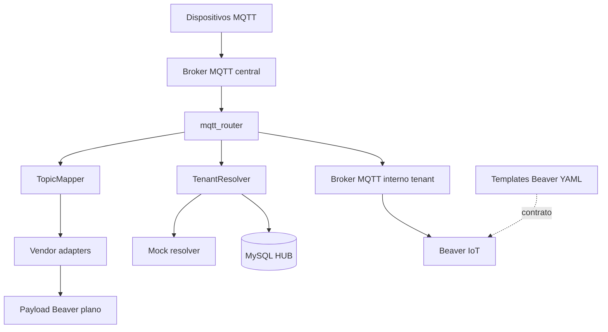
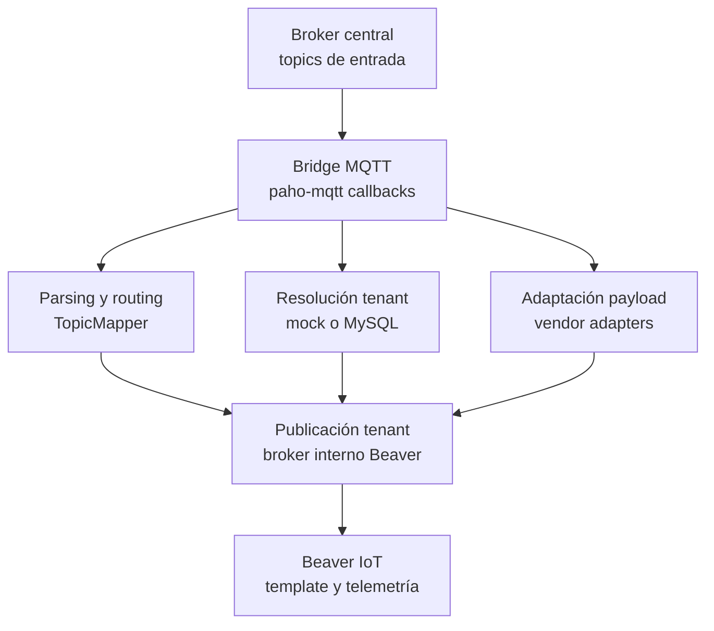
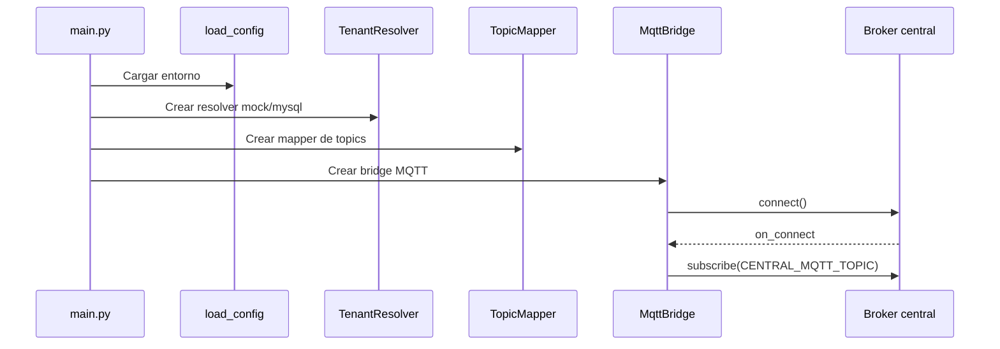
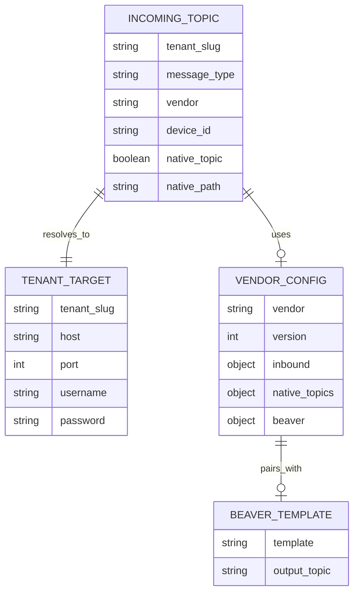
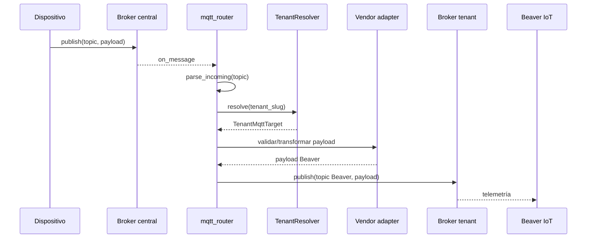

---
title: "Memoria Técnica Servicio MQTT Router"
author: "Xercode / Desarrollo"
date: "2026"
toc: true
numbersections: true
---

# Memoria técnica del servicio MQTT Router

Documento generado a partir de la inspección estática del código del proyecto `mqtt_router`.

`mqtt_router` es un servicio Python independiente del backend HUB. Comparte ubicación de workspace con otros componentes del proyecto, pero no importa módulos del backend FastAPI, no expone endpoints HTTP y se ejecuta como proceso propio.

## Introducción

`mqtt_router` es un servicio de enrutamiento MQTT diseñado para conectar un broker MQTT central con los brokers MQTT internos utilizados por instancias Beaver IoT asociadas a tenants. Su función principal es recibir telemetría de dispositivos, interpretar el topic de entrada, resolver el tenant destino, adaptar el payload cuando procede y publicar el mensaje resultante en el broker interno correspondiente.

El servicio permite mantener una arquitectura en la que los dispositivos publican contra un único broker central, mientras que las instancias internas de Beaver IoT permanecen aisladas y reciben únicamente los mensajes que corresponden a su tenant.

## Objetivo del documento

El objetivo de esta memoria es describir el servicio `mqtt_router` como entregable técnico: arquitectura, configuración, flujo de ejecución, contratos MQTT, adaptadores de vendor, resolución de tenants, dependencias, pruebas y generación documental.

La memoria diferencia:

- **Confirmado por código**: comportamiento, módulos, clases, contratos y dependencias presentes en el proyecto.
- **Inferencia técnica**: conclusiones razonables deducidas del diseño y la documentación local del componente.

## Alcance del servicio

El servicio cubre las siguientes áreas funcionales:

- Conexión a un broker MQTT central.
- Suscripción a uno o varios topics de entrada.
- Interpretación de topics MQTT legacy, vendor JSON y Shelly nativo.
- Resolución del tenant destino mediante resolver mock o MySQL.
- Validación y normalización de payloads JSON.
- Transformación de payloads de fabricantes mediante adaptadores JSON.
- Transformación específica de topics nativos Shelly.
- Publicación de telemetría hacia brokers MQTT internos de tenants Beaver.
- Selección de topic de salida Beaver por configuración global o por vendor.
- Logging operativo del ciclo de recepción, resolución, transformación y publicación.
- Pruebas unitarias del adaptador Shelly nativo.
- Versionado de templates Beaver relacionados con la integración Shelly.

No forman parte del alcance funcional del servicio:

- API HTTP.
- Interfaz gráfica.
- Persistencia propia de mensajes.
- Procesamiento de comandos Beaver hacia dispositivos.
- Consumo directo de plantillas YAML en runtime.

## Arquitectura general

La arquitectura del proyecto sigue un diseño de servicio Python modular:

| Capa | Carpeta/fichero | Responsabilidad |
| --- | --- | --- |
| Entrada del proceso | `mqtt_router/main.py` | Carga configuración, logging, resolver, mapper y arranca el bridge. |
| Configuración | `mqtt_router/config.py` | Define dataclasses de configuración y carga variables desde entorno. |
| Logging | `mqtt_router/logger.py` | Configura logging estándar de Python. |
| Bridge MQTT | `mqtt_router/bridge.py` | Gestiona conexión central, callbacks MQTT, transformación y publicación a tenant. |
| Resolución de tenants | `mqtt_router/tenant_resolver.py` | Resuelve `tenant_slug` a host/puerto/credenciales MQTT internas. |
| Mapeo de topics | `mqtt_router/topic_mapper.py` | Interpreta topics de entrada y selecciona topic de salida Beaver. |
| Adaptadores | `mqtt_router/adapters/` | Carga mappings JSON, transforma payloads y convierte tipos. |
| Configuración vendors | `mqtt_router/configs/vendors/` | Contiene mappings por fabricante. |
| Templates Beaver | `beaver_templates/` | Copias versionadas de plantillas Beaver asociadas a adaptadores. |
| Tests | `tests/` | Pruebas unitarias de transformación Shelly nativa. |

### Arquitectura visual



### Diagrama de capas



Inferencia técnica: el componente actúa como frontera operativa entre dispositivos externos y la infraestructura interna Beaver, concentrando contratos de entrada y salida en un único proceso especializado.

## Estructura de directorios

Estructura principal confirmada:

```text
mqtt_router/
  README.md
  DOCUMENTACION_TECNICA.md
  MQTT_CONTRACTS.md
  requirements.txt
  Dockerfile
  .env.example
  mqtt_router/
    __init__.py
    main.py
    config.py
    logger.py
    bridge.py
    tenant_resolver.py
    topic_mapper.py
    adapters/
      mapping_loader.py
      native_topic_matcher.py
      path_utils.py
      shelly_native_adapter.py
      value_converter.py
      vendor_adapter.py
    configs/
      vendors/
        shelly.json
  beaver_templates/
    shelly/
      README.md
      shelly-generic.device-template.yaml
      shelly-generic.device-template_v2.yaml
      shelly-generic.device-template_v3.yaml
      shelly_generic.new_try.yaml
  tests/
    test_shelly_native_adapter.py
```

## Tecnologías utilizadas

| Tecnología | Uso |
| --- | --- |
| Python | Lenguaje principal del servicio. |
| paho-mqtt | Cliente MQTT para broker central y brokers de tenants. |
| python-dotenv | Carga de variables desde `.env`. |
| PyMySQL | Consulta opcional a MySQL para resolver tenants. |
| JSON | Definición de mappings de vendor y transformación de payloads. |
| unittest | Pruebas unitarias del adaptador Shelly. |
| Docker | Contenedor de ejecución del servicio. |
| Mermaid | Diagramas de la memoria técnica. |
| Pandoc | Exportación documental a DOCX. |

## Configuración del entorno

La configuración se carga en `mqtt_router/config.py` mediante `load_config()`. El módulo usa `python-dotenv` para leer `.env` y construye una instancia `AppConfig`.

Variables confirmadas:

| Variable | Valor por defecto | Uso |
| --- | --- | --- |
| `CENTRAL_MQTT_HOST` | `localhost` | Host del broker MQTT central. |
| `CENTRAL_MQTT_PORT` | `1883` | Puerto del broker MQTT central. |
| `CENTRAL_MQTT_USERNAME` | Vacío | Usuario opcional del broker central. |
| `CENTRAL_MQTT_PASSWORD` | Vacío | Password opcional del broker central. |
| `CENTRAL_MQTT_TOPIC` | `#` | Topic o wildcard de suscripción central. |
| `CENTRAL_MQTT_CLIENT_ID` | `xercode-mqtt-router` | Identificador del cliente MQTT central. |
| `TENANT_MQTT_DEFAULT_USERNAME` | Vacío | Usuario por defecto para brokers internos de tenants. |
| `TENANT_MQTT_DEFAULT_PASSWORD` | Vacío | Password por defecto para brokers internos de tenants. |
| `BEAVER_MQTT_OUTPUT_TOPIC` | `beaver-iot/mqtt@default/mqtt-device/beaver/telemetry` | Topic Beaver global para salida legacy. |
| `TENANT_RESOLVER` | `mock` | Selecciona resolver `mock` o `mysql`. |
| `TENANT_CACHE_TTL_SECONDS` | `60` | TTL de caché para resoluciones MySQL. |
| `TENANT_MQTT_PORT` | `1883` | Puerto MQTT interno usado como default. |
| `MYSQL_HOST` / `DB_HOST` | `localhost` | Host MySQL para resolver tenants. |
| `MYSQL_PORT` / `DB_PORT` | `3306` | Puerto MySQL. |
| `MYSQL_DATABASE` / `DB_NAME` | Vacío | Base de datos del HUB. |
| `MYSQL_USER` / `DB_USER` | Vacío | Usuario MySQL. |
| `MYSQL_PASSWORD` / `DB_PASS` | Vacío | Password MySQL. |
| `LOG_LEVEL` | `INFO` | Nivel de logging. |

## Punto de entrada y ciclo de arranque

El punto de entrada confirmado es `mqtt_router/main.py`.

Flujo de arranque:

1. `load_config()` carga variables de entorno.
2. `configure_logging(config.log_level)` inicializa logging.
3. `build_tenant_resolver(config)` crea el resolver mock o MySQL.
4. `TopicMapper` se inicializa con el topic Beaver global.
5. `MqttBridge` recibe la configuración central, el resolver y el mapper.
6. `bridge.run_forever()` conecta al broker central y mantiene el loop MQTT.
7. `KeyboardInterrupt` detiene el servicio llamando a `bridge.stop()`.



## Contratos MQTT

El servicio soporta tres familias de topics de entrada.

### Legacy Xercode

```text
xercode/{tenant_slug}/telemetry
```

Este contrato publica payload JSON plano. El router valida que el payload sea JSON UTF-8 y lo republica compactado hacia el topic Beaver global.

### Vendor JSON normalizado

```text
xercode/{tenant_slug}/{vendor}/{device_id}/telemetry
```

Este contrato permite indicar fabricante y dispositivo en el topic. El payload se transforma mediante el JSON del vendor correspondiente en `mqtt_router/configs/vendors/{vendor}.json`.

### Shelly nativo

```text
shellies/x/{tenant_slug}/sh/{device_id}/telemetry/{native_path}
```

Este contrato está orientado a dispositivos Shelly reales configurados con el prefijo:

```text
x/{tenant_slug}/sh/{device_id}/telemetry
```

Los mensajes nativos Shelly se transforman en eventos parciales planos para Beaver.

### Topics de salida

| Tipo de entrada | Topic de salida |
| --- | --- |
| Legacy Xercode | `BEAVER_MQTT_OUTPUT_TOPIC` |
| Vendor con `beaver.output_topic` | Topic declarado en el JSON del vendor. |
| Shelly | `beaver-iot/mqtt@default/mqtt-device/shelly/telemetry` |

## Resolución de tenants

La resolución de tenants está centralizada en `mqtt_router/tenant_resolver.py`.

| Resolver | Clase | Descripción |
| --- | --- | --- |
| Mock | `MockTenantResolver` | Resuelve `tenant_a` y `tenant_b` hacia `localhost:1883`. |
| MySQL | `MySqlTenantResolver` | Consulta la tabla `tenants` por `code` e `is_active = 1`. |
| HUB API | `HubTenantResolver` | Clase preparada como punto de extensión. |

El resolver MySQL consulta:

```sql
SELECT
    code,
    beaver_base_url,
    beaver_mqtt_host,
    beaver_mqtt_port
FROM tenants
WHERE code = %s
  AND is_active = 1
LIMIT 1;
```

La selección de host utiliza `beaver_mqtt_host` cuando está disponible. En caso contrario, extrae el host desde `beaver_base_url`. El puerto usa `beaver_mqtt_port` si es válido o el default configurado en `TENANT_MQTT_PORT`.

## Modelo funcional de datos

`mqtt_router` no define base de datos propia. Su modelo funcional se compone de estructuras en memoria y contratos externos.

| Elemento | Tipo | Papel |
| --- | --- | --- |
| `AppConfig` | Dataclass | Configuración completa del proceso. |
| `CentralMqttConfig` | Dataclass | Conexión al broker central. |
| `TenantMqttTarget` | Dataclass | Destino MQTT interno de un tenant. |
| `IncomingTopic` | Dataclass | Resultado del parseo del topic de entrada. |
| Vendor config | JSON | Reglas de transformación por fabricante. |
| Beaver template | YAML | Contrato de telemetría esperado por Beaver. |



## Adaptadores de fabricante

Los adaptadores viven en `mqtt_router/adapters/` y permiten convertir mensajes de fabricantes a un payload plano compatible con Beaver.

| Módulo | Responsabilidad |
| --- | --- |
| `mapping_loader.py` | Carga y valida JSON de vendor. |
| `vendor_adapter.py` | Transforma payload JSON normalizado a payload plano Beaver. |
| `shelly_native_adapter.py` | Transforma topics nativos Shelly a eventos parciales. |
| `native_topic_matcher.py` | Compara topics contra patrones con placeholders. |
| `value_converter.py` | Convierte valores a `string`, `float`, `int` o `boolean`. |
| `path_utils.py` | Lee y escribe rutas anidadas en objetos JSON. |

### Adaptador Shelly

El archivo `mqtt_router/configs/vendors/shelly.json` define:

- Vendor `shelly`.
- Mappings para payload JSON normalizado.
- Mappings para topics nativos.
- Conversiones de tipo.
- Topic Beaver de salida.
- Template Beaver asociado.
- Metadatos de origen.

Campos Shelly confirmados en mappings nativos:

| Native path | Campo Beaver |
| --- | --- |
| `relay/0/power` | `power` |
| `relay/0/energy` | `energy` |
| `relay/0` | `output` |
| `temperature` | `temperature` |
| `temperature_f` | `temperature_f` |
| `overtemperature` | `overtemperature` |
| `sensor/temperature` | `temperature` |
| `sensor/battery` | `battery` |
| `sensor/flood` | `flood` |
| `sensor/lux` | `lux` |
| `status` | `motion`, `vibration`, `lux`, `battery`, `sensor_timestamp`, `sensor_active` |
| `info` | WiFi, cloud, MQTT, lux, sensor, batería, firmware y tiempo |

## Flujo de mensajes

El flujo principal del servicio es:

1. Dispositivo publica en broker central.
2. `MqttBridge._on_message()` recibe topic y payload.
3. `TopicMapper.parse_incoming()` interpreta el topic.
4. `TenantResolver.resolve()` obtiene destino MQTT interno.
5. `TopicMapper.to_tenant_topic()` selecciona topic Beaver de salida.
6. `_prepare_tenant_payload()` valida o transforma el payload.
7. `_publish_to_tenant()` publica en el broker interno del tenant.



## Gestión de errores

El servicio gestiona errores de forma local en el loop MQTT, evitando que un mensaje inválido detenga el proceso.

| Situación | Tratamiento |
| --- | --- |
| Topic no reconocido | Se registra warning y el mensaje se descarta. |
| Topic Shelly antiguo `shellies/xercode/...` | Se descarta con warning específico. |
| Tenant no encontrado | Se registra warning y el mensaje se descarta. |
| Payload legacy no JSON | Se descarta tras validación UTF-8/JSON. |
| Vendor config ausente o inválida | Se registra warning y se descarta el mensaje. |
| Error de transformación | Se registra error y se descarta el mensaje. |
| Fallo publicando en tenant | Se registra excepción y el proceso continúa. |
| Desconexión del broker central | Se registra el evento; paho-mqtt gestiona reconexión. |

## Logging y observabilidad

`mqtt_router/logger.py` configura logging estándar con el formato:

```text
%(asctime)s %(levelname)s [%(name)s] %(message)s
```

Eventos registrados por el servicio:

- Conexión al broker central.
- Suscripción al topic central.
- Recepción de mensajes.
- Resolución de tenant.
- Mapeo de topic.
- Transformación o descarte de payload.
- Conexión y publicación hacia broker de tenant.
- Desconexiones MQTT.

## Seguridad y aislamiento

El servicio está diseñado para que los dispositivos publiquen contra un broker central y no contra brokers internos de Beaver.

Controles y mecanismos confirmados:

| Elemento | Descripción |
| --- | --- |
| Broker central | Único punto MQTT expuesto a dispositivos. |
| Brokers tenant | Destinos internos resueltos por tenant. |
| Credenciales central | Configurables con `CENTRAL_MQTT_USERNAME` y `CENTRAL_MQTT_PASSWORD`. |
| Credenciales tenant | Configurables con defaults `TENANT_MQTT_DEFAULT_USERNAME` y `TENANT_MQTT_DEFAULT_PASSWORD`. |
| Tenant activo | En modo MySQL se filtra por `is_active = 1`. |
| Payload JSON | Validación previa a publicación legacy. |
| Topics vendor | Validación por patrón y mappings configurados. |

## Templates Beaver

La carpeta `beaver_templates/` contiene copias versionadas de plantillas Beaver relacionadas con los adaptadores.

Para Shelly:

| Archivo | Papel |
| --- | --- |
| `beaver_templates/shelly/shelly-generic.device-template.yaml` | Template Beaver principal asociado al adapter Shelly. |
| `shelly-generic.device-template_v2.yaml` | Versión alternativa/versionada. |
| `shelly-generic.device-template_v3.yaml` | Versión alternativa/versionada. |
| `shelly_generic.new_try.yaml` | Variante de trabajo/versionada. |
| `beaver_templates/shelly/README.md` | Explica la relación adapter-template. |

El servicio no consume estos YAML en runtime. La relación funcional se establece mediante `shelly.json`, que declara:

```json
{
  "beaver": {
    "output_topic": "beaver-iot/mqtt@default/mqtt-device/shelly/telemetry",
    "template": "shelly-generic",
    "template_file": "beaver_templates/shelly/shelly-generic.device-template.yaml"
  }
}
```

## Pruebas

El proyecto incluye pruebas unitarias en `tests/test_shelly_native_adapter.py`.

Cobertura funcional confirmada:

| Test | Validación |
| --- | --- |
| `test_scalar_native_mapping_still_works` | Conversión de topic escalar `relay/0/power`. |
| `test_status_json_mapping_extracts_motion_fields` | Extracción de campos desde payload JSON `status`. |
| `test_info_json_mapping_extracts_motion_and_device_fields` | Extracción de campos de dispositivo, WiFi, batería y firmware desde `info`. |
| `test_missing_payload_path_does_not_break_transform` | Campos ausentes no detienen transformación. |
| `test_failed_json_field_conversion_does_not_break_other_fields` | Conversiones fallidas no bloquean otros campos cuando procede. |

## Despliegue y ejecución

### Ejecución local

```powershell
pip install -r requirements.txt
copy .env.example .env
python -m mqtt_router.main
```

### Docker

El `Dockerfile`:

1. Usa `python:3.12-slim`.
2. Copia `requirements.txt`.
3. Instala dependencias Python.
4. Copia el paquete `mqtt_router`.
5. Ejecuta `python -m mqtt_router.main`.

Comando definido:

```text
CMD ["python", "-m", "mqtt_router.main"]
```

## Dependencias externas

| Dependencia | Uso |
| --- | --- |
| Broker MQTT central | Entrada de mensajes de dispositivos. |
| Brokers MQTT internos Beaver | Destino de publicación por tenant. |
| MySQL HUB | Resolución opcional de tenants en modo `mysql`. |
| Beaver IoT | Consumo final de telemetría MQTT. |
| Templates Beaver | Contrato de campos y topic esperado por Beaver. |

## Consideraciones de entrega

Esta memoria describe `mqtt_router` como servicio independiente y entregable técnico. El componente se centra en la recepción, transformación y redistribución de telemetría MQTT hacia Beaver IoT.

| Ámbito | Consideración |
| --- | --- |
| Configuración | El servicio se parametriza por entorno y `.env`. |
| Integración MQTT | Usa paho-mqtt para broker central y publicación hacia tenants. |
| Resolución tenants | Soporta mock local y consulta MySQL al HUB. |
| Adaptadores | Los vendors se declaran por JSON y se aplican sin modificar el bridge. |
| Shelly | Incluye soporte para payload JSON normalizado y topics nativos. |
| Beaver | Los topics de salida y templates asociados quedan versionados en el proyecto. |
| Documentación | El Markdown fuente conserva diagramas Mermaid y puede exportarse a DOCX con el pipeline incluido. |

## Resumen ejecutivo final

`mqtt_router` es un servicio Python standalone que actúa como puente MQTT entre dispositivos externos y brokers internos Beaver IoT por tenant. Su diseño separa claramente conexión MQTT, resolución de tenants, mapeo de topics y transformación de payloads por fabricante.

La implementación actual soporta contratos legacy Xercode, contratos vendor JSON y topics nativos Shelly. La configuración por JSON permite extender mappings de fabricantes manteniendo estable la lógica principal del bridge.

El proyecto queda documentado como entregable técnico mediante esta memoria Markdown, diagramas Mermaid y un pipeline reproducible para generar DOCX con Pandoc.


